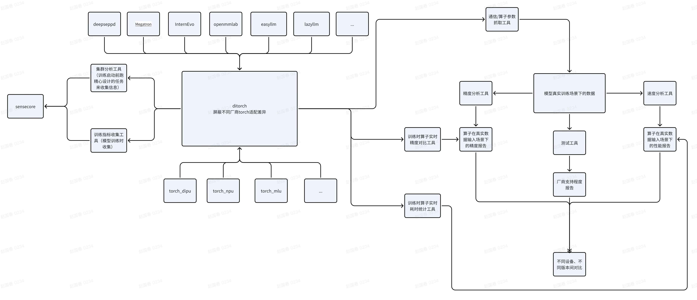

# 设备无关torch, 旨在屏蔽各硬件厂商torch差异，为用户提供一致使用体验


## 核心点
### 1. 两行代码即可像官方pytorch一样在国产芯片上使用pytorch
```
import torch
import ditorch
```


### 2. 提供模型训练过程中需要的基础工具，解决模型训练过程中出现的痛点问题
[算子工具](op_tools/README.md)

#### 算子参数抓取工具
抓取模型真实训练过程中真实的输入输出
```
# 抓取前向和反向的所有输入输出
op_capture_result/0/2024-08-06--11-41/torch.Tensor.to/8/input.pth saved
op_capture_result/0/2024-08-06--11-41/torch.Tensor.to/8/output.pth saved
apply OpCaptureHook on torch.Tensor.mul
op_capture_result/0/2024-08-06--11-41/torch.Tensor.mul/9/input.pth saved
op_capture_result/0/2024-08-06--11-41/torch.Tensor.mul/9/output.pth saved
apply OpCaptureHook on torch.Tensor.add
op_capture_result/0/2024-08-06--11-41/torch.Tensor.add/10/input.pth saved
op_capture_result/0/2024-08-06--11-41/torch.Tensor.add/10/output.pth saved
apply OpCaptureHook on torch.Tensor.sub
op_capture_result/0/2024-08-06--11-41/torch.Tensor.sub/11/input.pth saved
op_capture_result/0/2024-08-06--11-41/torch.Tensor.sub/11/output.pth saved
apply OpCaptureHook on torch.Tensor.div
op_capture_result/0/2024-08-06--11-41/torch.Tensor.div/12/input.pth saved
op_capture_result/0/2024-08-06--11-41/torch.Tensor.div/12/output.pth saved
apply OpCaptureHook on torch.Tensor.sort
op_capture_result/0/2024-08-06--11-41/torch.Tensor.sort/13/input.pth saved
op_capture_result/0/2024-08-06--11-41/torch.Tensor.sort/13/output.pth saved
apply OpCaptureHook on torch.Tensor.sum
op_capture_result/0/2024-08-06--11-41/torch.Tensor.sum/14/input.pth saved
op_capture_result/0/2024-08-06--11-41/torch.Tensor.sum/14/output.pth saved
skip OpCaptureHook on torch.Tensor.backward
op_capture_result/0/2024-08-06--11-41/torch.Tensor.sum/14/grad_inputs.pth saved
op_capture_result/0/2024-08-06--11-41/torch.Tensor.sum/14/grad_outputs.pth saved
op_capture_result/0/2024-08-06--11-41/torch.Tensor.sort/13/grad_inputs.pth saved
op_capture_result/0/2024-08-06--11-41/torch.Tensor.sort/13/grad_outputs.pth saved
op_capture_result/0/2024-08-06--11-41/torch.Tensor.to/8/grad_inputs.pth saved
op_capture_result/0/2024-08-06--11-41/torch.Tensor.to/8/grad_outputs.pth saved
...
```

```
# 只抓取sort算子的参数，忽略其他算子 OP_CAPTURE_LIST=torch.Tensor.sort
skip OpCaptureHook on torch.device
skip OpCaptureHook on torch.Tensor.to
skip OpCaptureHook on torch.Tensor.mul
skip OpCaptureHook on torch.Tensor.add
skip OpCaptureHook on torch.Tensor.sub
skip OpCaptureHook on torch.Tensor.div
apply OpCaptureHook on torch.Tensor.sort
op_capture_result/0/2024-08-06--11-41/torch.Tensor.sort/34/input.pth saved
op_capture_result/0/2024-08-06--11-41/torch.Tensor.sort/34/output.pth saved
op_capture_result/0/2024-08-06--11-41/torch.Tensor.sort/34/grad_inputs.pth saved
op_capture_result/0/2024-08-06--11-41/torch.Tensor.sort/34/grad_outputs.pth saved
...
```

```
# 排除指定算子，抓取所有其他算子 OP_CAPTURE_DISABLE_LIST="torch.Tensor.sort,torch.Tensor.add"
apply OpCaptureHook on torch.Tensor.to
op_capture_result/0/2024-08-06--11-46/torch.Tensor.to/29/input.pth saved
op_capture_result/0/2024-08-06--11-46/torch.Tensor.to/29/output.pth saved
apply OpCaptureHook on torch.Tensor.mul
op_capture_result/0/2024-08-06--11-46/torch.Tensor.mul/30/input.pth saved
op_capture_result/0/2024-08-06--11-46/torch.Tensor.mul/30/output.pth saved
skip OpCaptureHook on torch.Tensor.add
skip OpCaptureHook on torch.Tensor.sub
apply OpCaptureHook on torch.Tensor.div
op_capture_result/0/2024-08-06--11-46/torch.Tensor.div/31/input.pth saved
op_capture_result/0/2024-08-06--11-46/torch.Tensor.div/31/output.pth saved
apply OpCaptureHook on torch.Tensor.sort
op_capture_result/0/2024-08-06--11-46/torch.Tensor.sort/32/input.pth saved
op_capture_result/0/2024-08-06--11-46/torch.Tensor.sort/32/output.pth saved
apply OpCaptureHook on torch.Tensor.sum
op_capture_result/0/2024-08-06--11-46/torch.Tensor.sum/33/input.pth saved
op_capture_result/0/2024-08-06--11-46/torch.Tensor.sum/33/output.pth saved
...
```
#### 精度分析工具
离线分析 + 实时精度对比
1. 用模型训练过程中真实输入输出，离线对比
2. 模型训练时实时与cpu对比分析精度
```
# 基于InternEvo + ditorch + torch_npu 在华为910B上实时精度分析输出片段
OpAutoCompareHook: torch.Tensor.contiguous                            max_diff:          0.000000000
OpAutoCompareHook: torch.Tensor.is_complex                            max_diff:          0.000000000
OpAutoCompareHook: torch.Tensor.add                                   max_diff:          0.000000000
OpAutoCompareHook: torch.nn.functional.dropout                        max_diff:          0.000000000
OpAutoCompareHook: torch.Tensor.to                                    max_diff:          0.000000000
OpAutoCompareHook: torch.Tensor.to                                    max_diff:          0.000000000
OpAutoCompareHook: torch.Tensor.pow                                   max_diff:          0.000000000
OpAutoCompareHook: torch.Tensor.mean                                  max_diff:          0.000000179
OpAutoCompareHook: torch.Tensor.add                                   max_diff:          0.000000000
OpAutoCompareHook: torch.rsqrt                                        max_diff:          0.000000119
OpAutoCompareHook: torch.Tensor.mul                                   max_diff:          0.000000000
OpAutoCompareHook: torch.Tensor.to                                    max_diff:          0.000000000
OpAutoCompareHook: torch.Tensor.mul                                   max_diff:          0.000000000
OpAutoCompareHook: torch.Tensor.contiguous                            max_diff:          0.000000000
OpAutoCompareHook: torch.Tensor.contiguous                            max_diff:          0.000000000
OpAutoCompareHook: torch.nn.functional.linear                         max_diff:          0.015625000
op_capture_result/2024-08-02--16-31/1915529/torch.nn.functional.linear/device_input.pth saved
op_capture_result/2024-08-02--16-31/1915529/torch.nn.functional.linear/device_input.pth.json saved
op_capture_result/2024-08-02--16-31/1915529/torch.nn.functional.linear/device_output.pth saved
op_capture_result/2024-08-02--16-31/1915529/torch.nn.functional.linear/device_output.pth.json saved
op_capture_result/2024-08-02--16-31/1915529/torch.nn.functional.linear/cpu_input.pth saved
op_capture_result/2024-08-02--16-31/1915529/torch.nn.functional.linear/cpu_input.pth.json saved
op_capture_result/2024-08-02--16-31/1915529/torch.nn.functional.linear/cpu_output.pth saved
op_capture_result/2024-08-02--16-31/1915529/torch.nn.functional.linear/cpu_output.pth.json saved
OpAutoCompareHook: torch.stack                                        max_diff:          0.000000000
OpAutoCompareHook: torch.functional.norm                              max_diff:          0.000000000
OpAutoCompareHook: torch.Tensor.unsqueeze                             max_diff:          0.000000000
OpAutoCompareHook: torch.Tensor.__pow__                               max_diff:          0.000000000
OpAutoCompareHook: torch.Tensor.to                                    max_diff:          0.000000000
OpAutoCompareHook: torch.Tensor.to                                    max_diff:          0.000000000
OpAutoCompareHook: torch.Tensor.to                                    max_diff:          0.000000000
OpAutoCompareHook: torch.Tensor.float                                 max_diff:          0.000000000
OpAutoCompareHook: torch.Tensor.float                                 max_diff:          0.000000000
OpAutoCompareHook: torch.functional.norm                              max_diff:          0.000000000
OpAutoCompareHook: torch.stack                                        max_diff:          0.000000000
OpAutoCompareHook: torch.functional.norm                              max_diff:          0.000000000
OpAutoCompareHook: torch.Tensor.unsqueeze                             max_diff:          0.000000000
OpAutoCompareHook: torch.Tensor.__pow__                               max_diff:          0.000000000
OpAutoCompareHook: torch.Tensor.to                                    max_diff:          0.000000000
OpAutoCompareHook: torch.Tensor.float                                 max_diff:          0.000000000
OpAutoCompareHook: torch.Tensor.float                                 max_diff:          0.000000000
OpAutoCompareHook: torch.functional.norm                              max_diff:        760.125000000
op_capture_result/2024-08-02--16-29/1915529/torch.functional.norm/device_input.pth saved
op_capture_result/2024-08-02--16-29/1915529/torch.functional.norm/device_input.pth.json saved
op_capture_result/2024-08-02--16-29/1915529/torch.functional.norm/device_output.pth saved
op_capture_result/2024-08-02--16-29/1915529/torch.functional.norm/device_output.pth.json saved
op_capture_result/2024-08-02--16-29/1915529/torch.functional.norm/cpu_input.pth saved
op_capture_result/2024-08-02--16-29/1915529/torch.functional.norm/cpu_input.pth.json saved
op_capture_result/2024-08-02--16-29/1915529/torch.functional.norm/cpu_output.pth saved
op_capture_result/2024-08-02--16-29/1915529/torch.functional.norm/cpu_output.pth.json saved
OpAutoCompareHook: torch.Tensor.to                                    compare_result: Inconsistent dtypes: torch.float32 torch.float64, max_diff:0.0
```

#### 性能分析工具
用模型训练过程中真实的输入输出分析算子和通信的耗时，分析出性能瓶颈
```
# 测量算子耗时（输入为使用算子抓取工具在模型训练时抓取到的真实数据）
SyncExecuteTimer: torch.Tensor.add forward elasped 0.03838539 ms
SyncExecuteTimer: torch.Tensor.add forward elasped 0.03552437 ms
SyncExecuteTimer: torch.Tensor.add forward elasped 0.03147125 ms
SyncExecuteTimer: torch.Tensor.add forward elasped 0.03147125 ms
SyncExecuteTimer: torch.Tensor.add forward elasped 0.03528595 ms
SyncExecuteTimer: torch.Tensor.add forward elasped 0.11086464 ms
SyncExecuteTimer: torch.Tensor.add forward elasped 0.03838539 ms
SyncExecuteTimer: torch.Tensor.add forward elasped 0.03790855 ms
SyncExecuteTimer: torch.Tensor.add forward elasped 0.03862381 ms
SyncExecuteTimer: torch.Tensor.add forward elasped 0.03194809 ms
SyncExecuteTimer: torch.Tensor.add forward elasped 0.03409386 ms
SyncExecuteTimer: torch.Tensor.add forward elasped 0.03123283 ms
SyncExecuteTimer: torch.Tensor.add forward elasped 0.02837181 ms
SyncExecuteTimer: torch.Tensor.add forward elasped 0.03528595 ms
SyncExecuteTimer: torch.Tensor.add forward elasped 0.03170967 ms
SyncExecuteTimer: torch.Tensor.add forward elasped 0.03361702 ms
SyncExecuteTimer: torch.Tensor.add forward elasped 0.03409386 ms
SyncExecuteTimer: torch.Tensor.add forward elasped 0.03433228 ms
SyncExecuteTimer: torch.Tensor.add forward elasped 0.03409386 ms
SyncExecuteTimer: torch.Tensor.add forward elasped 0.03123283 ms
SyncExecuteTimer: torch.Tensor.add forward elasped 0.03528595 ms
SyncExecuteTimer: torch.Tensor.add forward elasped 0.03314018 ms
SyncExecuteTimer: torch.Tensor.add forward elasped 0.03170967 ms
SyncExecuteTimer: torch.Tensor.add forward elasped 0.03743172 ms
SyncExecuteTimer: torch.Tensor.add forward elasped 0.03361702 ms
SyncExecuteTimer: torch.Tensor.add forward elasped 0.03743172 ms
```