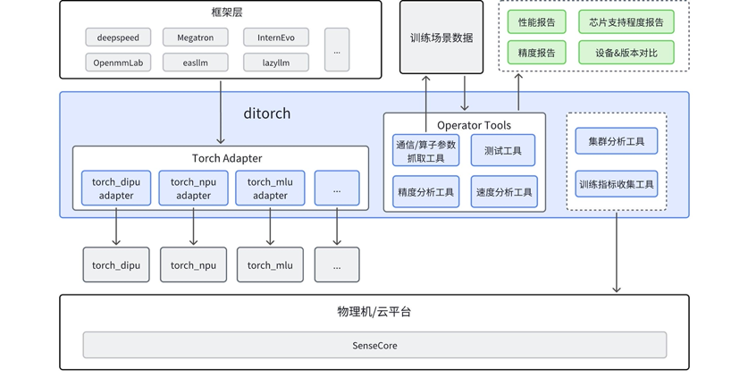

# ditorch

ditorch 是设备无关 torch， 旨在屏蔽各硬件厂商 torch 差异，为用户提供一致使用体验。通过 ditorch，开发者可以适配多个硬件算子库；此外，ditorch 提供训练过程中需要的基础工具，解决模型训练过程中出现的痛点问题。




# **核心功能**
## **1. 可无感切换 pytorch 至国产芯片**

只需添加两行代码，即可在国产芯片上像官方 pytorch 一样使用。
```
import torch
import ditorch
```

[ditorch + Ascend910 pytorch原生测例通过情况](ditorch/test/ascend_summary_of_pytorch_test_case_testing.csv.tar)

[ditorch + mlu370_m8 pytorch原生测例通过情况](ditorch/test/camb_summary_of_pytorch_test_case_testing.csv.tar)

## **2. 提供多个基础工具，解决训练过程的问题**

提供模型训练过程中需要的基础工具，解决模型训练过程中出现的痛点问题 [算子工具](op_tools/README.md)。

| 序号 |  工具  |  简介  |
| ---- |  ------  |  ------  |
| 1 | [算子参数抓取工具](#tool1) |  抓取模型真实训练过程中真实的输入输出  |
| 2 | [精度分析工具](#tool2) | 进行离线和实时的精度分析 |
| 3 | [速度分析工具](#tool3) | 可进行离线和实时的耗时分析，协助性能优化 |
| 4 | [算子 Fallback](#tool4) | 可将指定、全部算子在设备上运行的操作 fallback 到 CPU 计算 |
| 5 | [算子数据类型转换工具](#tool5) | 可将指定、全部算子的特定数据类型转到给定数据类型去计算 |


### **算子参数抓取工具** <a id="tool1"></a>
抓取模型真实训练过程中真实的输入输出：
```
# usage1
import op_tools
capture = op_tools.OpCapture()
capture.start()
code_snippet_to_capture
capture.stop()
...
```

```
# usage2
import op_tools
with op_tools.OpCapture():
    code_snippet_to_capture()
```

#### **抓取前向和反向的所有输入输出**

```
...
apply OpCaptureHook on torch.Tensor.add
op_tools_results/op_capture_results/torch.Tensor.add/283699/161/2024-10-09-11-42-15/input.pth saved
op_tools_results/op_capture_results/torch.Tensor.add/283699/161/2024-10-09-11-42-15/output.pth saved
torch.Tensor.add    forward_id:161/2024-10-09-11-42-15    /deeplink_afs/zhaoguochun/SmallModelOptimize/InternTrain/internlm/model/ops/norm.py:14 manual_rms_norm: my_input = my_input * torch.rsqrt(variance + eps)
+----------------------------+--------+---------+-------+---------------+---------------+---------------+---------------+----------------+-------+
|            name            | device |  dtype  | numel |     shape     |     stride    | requires_grad |     layout    |    data_ptr    | value |
+----------------------------+--------+---------+-------+---------------+---------------+---------------+---------------+----------------+-------+
| torch.Tensor.add inputs[0] | npu:0  | float32 | 16384 | (1, 16384, 1) | (16384, 1, 1) |     False     | torch.strided | 20067180408320 |       |
| torch.Tensor.add inputs[1] |        |         |       |               |               |               |               |                | 1e-05 |
|  torch.Tensor.add outputs  | npu:0  | float32 | 16384 | (1, 16384, 1) | (16384, 1, 1) |     False     | torch.strided | 20067180474368 |       |
+----------------------------+--------+---------+-------+---------------+---------------+---------------+---------------+----------------+-------+


apply OpCaptureHook on torch.rsqrt
op_tools_results/op_capture_results/torch.rsqrt/283699/162/2024-10-09-11-42-15/input.pth saved
op_tools_results/op_capture_results/torch.rsqrt/283699/162/2024-10-09-11-42-15/output.pth saved
torch.rsqrt    forward_id:162/2024-10-09-11-42-15    /deeplink_afs/zhaoguochun/SmallModelOptimize/InternTrain/internlm/model/ops/norm.py:14 manual_rms_norm: my_input = my_input * torch.rsqrt(variance + eps)
+---------------------+--------+---------+-------+---------------+---------------+---------------+---------------+----------------+
|         name        | device |  dtype  | numel |     shape     |     stride    | requires_grad |     layout    |    data_ptr    |
+---------------------+--------+---------+-------+---------------+---------------+---------------+---------------+----------------+
|  torch.rsqrt inputs | npu:0  | float32 | 16384 | (1, 16384, 1) | (16384, 1, 1) |     False     | torch.strided | 20067180474368 |
| torch.rsqrt outputs | npu:0  | float32 | 16384 | (1, 16384, 1) | (16384, 1, 1) |     False     | torch.strided | 20067180540416 |
+---------------------+--------+---------+-------+---------------+---------------+---------------+---------------+----------------+


apply OpCaptureHook on torch.Tensor.mul
op_tools_results/op_capture_results/torch.Tensor.mul/283699/163/2024-10-09-11-42-15/input.pth saved
op_tools_results/op_capture_results/torch.Tensor.mul/283699/163/2024-10-09-11-42-15/output.pth saved
torch.Tensor.mul    forward_id:163/2024-10-09-11-42-15    /deeplink_afs/zhaoguochun/SmallModelOptimize/InternTrain/internlm/model/ops/norm.py:14 manual_rms_norm: my_input = my_input * torch.rsqrt(variance + eps)
+----------------------------+--------+----------+----------+------------------+---------------------+---------------+---------------+----------------+
|            name            | device |  dtype   |  numel   |      shape       |        stride       | requires_grad |     layout    |    data_ptr    |
+----------------------------+--------+----------+----------+------------------+---------------------+---------------+---------------+----------------+
| torch.Tensor.mul inputs[0] | npu:0  | bfloat16 | 33554432 | (1, 16384, 2048) | (33554432, 2048, 1) |      True     | torch.strided | 20074677141504 |
| torch.Tensor.mul inputs[1] | npu:0  | float32  |  16384   |  (1, 16384, 1)   |    (16384, 1, 1)    |     False     | torch.strided | 20067180540416 |
|  torch.Tensor.mul outputs  | npu:0  | float32  | 33554432 | (1, 16384, 2048) | (33554432, 2048, 1) |     False     | torch.strided | 20075012687360 |
+----------------------------+--------+----------+----------+------------------+---------------------+---------------+---------------+----------------+
...
```

#### **只抓取sort算子的参数，忽略其他算子 OP_CAPTURE_LIST=torch.Tensor.sort**
```
...
skip OpCaptureHook on torch.Tensor.mul
skip OpCaptureHook on torch.Tensor.div
op_tools_results/op_capture_results/torch.Tensor.sort/3834328/59/2024-10-09-11-40-14/input.pth saved
op_tools_results/op_capture_results/torch.Tensor.sort/3834328/59/2024-10-09-11-40-14/output.pth saved
torch.Tensor.sort    forward_id:59/2024-10-09-11-40-14    /deeplink_afs/zhaoguochun/ditorch2/op_tools/test/test_op_capture.py:15 f: sorted, indices = e.sort()  # return torch.return_type.sort
+----------------------------------+--------+---------+-------+----------+---------+---------------+---------------+----------------+
|               name               | device |  dtype  | numel |  shape   |  stride | requires_grad |     layout    |    data_ptr    |
+----------------------------------+--------+---------+-------+----------+---------+---------------+---------------+----------------+
|     torch.Tensor.sort inputs     | npu:0  | float32 |  200  | (10, 20) | (20, 1) |      True     | torch.strided | 20067179830784 |
| torch.Tensor.sort outputs [0][0] | npu:0  | float32 |  200  | (10, 20) | (20, 1) |      True     | torch.strided | 20067179831808 |
| torch.Tensor.sort outputs [0][1] | npu:0  |  int64  |  200  | (10, 20) | (20, 1) |     False     | torch.strided | 20067179832832 |
+----------------------------------+--------+---------+-------+----------+---------+---------------+---------------+----------------+


skip OpCaptureHook on torch.Tensor.__getitem__
skip OpCaptureHook on torch.Tensor.sum
op_tools_results/op_capture_results/torch.Tensor.sort/3834328/59/2024-10-09-11-40-14/grad_inputs.pth saved
op_tools_results/op_capture_results/torch.Tensor.sort/3834328/59/2024-10-09-11-40-14/grad_outputs.pth saved
torch.Tensor.sort forward_id:<built-in function id>
+-------------------------------+--------+---------+-------+----------+---------+---------------+---------------+----------------+
|              name             | device |  dtype  | numel |  shape   |  stride | requires_grad |     layout    |    data_ptr    |
+-------------------------------+--------+---------+-------+----------+---------+---------------+---------------+----------------+
| torch.Tensor.sort grad_output | npu:0  | float32 |  200  | (10, 20) | (20, 1) |     False     | torch.strided | 20067179835904 |
| torch.Tensor.sort grad_inputs | npu:0  | float32 |  200  | (10, 20) | (20, 1) |     False     | torch.strided | 20067179836928 |
+-------------------------------+--------+---------+-------+----------+---------+---------------+---------------+----------------+
...
```

#### **排除指定算子，抓取所有其他算子 OP_CAPTURE_DISABLE_LIST="torch.Tensor.add,torch.Tensor.sub"**
```
apply OpCaptureHook on torch.Tensor.to
op_capture_result/0/2024-08-06--11-46/torch.Tensor.to/29/input.pth saved
op_capture_result/0/2024-08-06--11-46/torch.Tensor.to/29/output.pth saved
apply OpCaptureHook on torch.Tensor.mul
op_capture_result/0/2024-08-06--11-46/torch.Tensor.mul/30/input.pth saved
op_capture_result/0/2024-08-06--11-46/torch.Tensor.mul/30/output.pth saved
skip OpCaptureHook on torch.Tensor.add
skip OpCaptureHook on torch.Tensor.sub
apply OpCaptureHook on torch.Tensor.div
op_capture_result/0/2024-08-06--11-46/torch.Tensor.div/31/input.pth saved
op_capture_result/0/2024-08-06--11-46/torch.Tensor.div/31/output.pth saved
apply OpCaptureHook on torch.Tensor.sort
op_capture_result/0/2024-08-06--11-46/torch.Tensor.sort/32/input.pth saved
op_capture_result/0/2024-08-06--11-46/torch.Tensor.sort/32/output.pth saved
apply OpCaptureHook on torch.Tensor.sum
op_capture_result/0/2024-08-06--11-46/torch.Tensor.sum/33/input.pth saved
op_capture_result/0/2024-08-06--11-46/torch.Tensor.sum/33/output.pth saved
...
```
### **精度分析工具** <a id="tool2"></a>
精度分析工具可以实现：
1. 离线分析：用模型训练过程中真实输入输出，离线对比。
2. 实时精度对比：模型训练时实时与cpu对比分析精度。

```
# usage1
import op_tools
with op_tools.OpAutoCompare():
    code_snippet_to_autocompare()
```

```
# usage2
import op_tools
autocompare = op_tools.OpAutoCompare()
autocompare.start()
code_snippet_to_autocompare()
autocompare.stop()
```
可通过设置: AUTOCOMPARE_ERROR_TOLERANCE_FLOAT16,  AUTOCOMPARE_ERROR_TOLERANCE_FLOAT32,  AUTOCOMPARE_ERROR_TOLERANCE_FLOAT64,  AUTOCOMPARE_ERROR_TOLERANCE 这几个环境变量来自定义精度阈值。

```
# for float16
export AUTOCOMPARE_ERROR_TOLERANCE_FLOAT16="1e-3,1e-4" # atol=1e-3, rtol=1e-4
# for bfloat16
export AUTOCOMPARE_ERROR_TOLERANCE_BFLOAT16="1e-2,1e-3" # atol=1e-2, rtol=1e-3
# for other dtype
export AUTOCOMPARE_ERROR_TOLERANCE="1e-4,1e-5" # atol=1e-4, rtol=1e-5
```

#### **基于InternEvo + ditorch + torch_npu 在华为910B上实时精度分析输出片段**


```
...
torch.Tensor.mul forward_id: 165    cpu_dtype_cast_info(from:to): {torch.bfloat16: torch.float64}
/deeplink_afs/zhaoguochun/SmallModelOptimize/InternTrain/internlm/model/ops/norm.py:26 manual_rms_norm: return weight * my_input
+---------------------------------+------------------+---------------------+----------+----------+--------+---------------+---------------+-----------------+
|               name              |      shape       |        stride       |  numel   |  dtype   | device | requires_grad |     layout    |     data_ptr    |
+---------------------------------+------------------+---------------------+----------+----------+--------+---------------+---------------+-----------------+
|    torch.Tensor.mul inputs[0]   |     (2048,)      |         (1,)        |   2048   | bfloat16 | npu:0  |      True     | torch.strided |  20076634832896 |
|    torch.Tensor.mul inputs[1]   | (1, 16384, 2048) | (33554432, 2048, 1) | 33554432 | bfloat16 | npu:0  |     False     | torch.strided |  20067477619200 |
|     torch.Tensor.mul outputs    | (1, 16384, 2048) | (33554432, 2048, 1) | 33554432 | bfloat16 | npu:0  |     False     | torch.strided |  20067544728576 |
| torch.Tensor.mul inputs(cpu)[0] |     (2048,)      |         (1,)        |   2048   | float64  |  cpu   |     False     | torch.strided |   34492000832   |
| torch.Tensor.mul inputs(cpu)[1] | (1, 16384, 2048) | (33554432, 2048, 1) | 33554432 | float64  |  cpu   |     False     | torch.strided | 140503487049792 |
|  torch.Tensor.mul outputs(cpu)  | (1, 16384, 2048) | (33554432, 2048, 1) | 33554432 | float64  |  cpu   |     False     | torch.strided | 140503218610240 |
+---------------------------------+------------------+---------------------+----------+----------+--------+---------------+---------------+-----------------+
+--------------------------------+----------+--------------+-------------------+-------------+-------------+---------------------------------------------------+
|              name              | allclose | max_abs_diff | max_relative_diff |     atol    |     rtol    |                     error_info                    |
+--------------------------------+----------+--------------+-------------------+-------------+-------------+---------------------------------------------------+
| torch.Tensor.mul input[0]      |   True   | 0.000000000  |    0.000000000    | 0.001000000 | 0.001000000 | Inconsistent dtypes: torch.bfloat16 torch.float64 |
| torch.Tensor.mul input[1]      |   True   | 0.000000000  |    0.000000000    | 0.001000000 | 0.001000000 | Inconsistent dtypes: torch.bfloat16 torch.float64 |
| torch.Tensor.mul output        |   True   | 0.000000000  |    0.000000000    | 0.001000000 | 0.001000000 | Inconsistent dtypes: torch.bfloat16 torch.float64 |
+--------------------------------+----------+--------------+-------------------+-------------+-------------+---------------------------------------------------+

...
torch.Tensor.reshape forward_id: 173    cpu_dtype_cast_info(from:to): {torch.bfloat16: torch.float64}
/deeplink_afs/zhaoguochun/SmallModelOptimize/InternTrain/internlm/model/modeling_internlm2.py:421 _packed_forward: q = rearrange(q, "b t h gs d -> b t (h gs) d")
+-----------------------------------------+-----------------------+-------------------------------+----------+----------+--------+---------------+---------------+-----------------+-------+
|                   name                  |         shape         |             stride            |  numel   |  dtype   | device | requires_grad |     layout    |     data_ptr    | value |
+-----------------------------------------+-----------------------+-------------------------------+----------+----------+--------+---------------+---------------+-----------------+-------+
|      torch.Tensor.reshape inputs[0]     | (1, 16384, 8, 2, 128) | (67108864, 4096, 512, 128, 1) | 33554432 | bfloat16 | npu:0  |     False     | torch.strided |  20067611837952 |       |
|    torch.Tensor.reshape inputs [1][0]   |                       |                               |          |          |        |               |               |                 |   1   |
|    torch.Tensor.reshape inputs [1][1]   |                       |                               |          |          |        |               |               |                 | 16384 |
|    torch.Tensor.reshape inputs [1][2]   |                       |                               |          |          |        |               |               |                 |   16  |
|    torch.Tensor.reshape inputs [1][3]   |                       |                               |          |          |        |               |               |                 |  128  |
|       torch.Tensor.reshape outputs      |  (1, 16384, 16, 128)  |    (33554432, 2048, 128, 1)   | 33554432 | bfloat16 | npu:0  |     False     | torch.strided |  20067477619200 |       |
|   torch.Tensor.reshape inputs(cpu)[0]   | (1, 16384, 8, 2, 128) | (33554432, 2048, 256, 128, 1) | 33554432 | float64  |  cpu   |     False     | torch.strided | 140502405996608 |       |
| torch.Tensor.reshape inputs(cpu) [1][0] |                       |                               |          |          |        |               |               |                 |   1   |
| torch.Tensor.reshape inputs(cpu) [1][1] |                       |                               |          |          |        |               |               |                 | 16384 |
| torch.Tensor.reshape inputs(cpu) [1][2] |                       |                               |          |          |        |               |               |                 |   16  |
| torch.Tensor.reshape inputs(cpu) [1][3] |                       |                               |          |          |        |               |               |                 |  128  |
|    torch.Tensor.reshape outputs(cpu)    |  (1, 16384, 16, 128)  |    (33554432, 2048, 128, 1)   | 33554432 | float64  |  cpu   |     False     | torch.strided | 140502405996608 |       |
+-----------------------------------------+-----------------------+-------------------------------+----------+----------+--------+---------------+---------------+-----------------+-------+
+--------------------------------+----------+--------------+-------------------+-------------+-------------+---------------------------------------------------+
|              name              | allclose | max_abs_diff | max_relative_diff |     atol    |     rtol    |                     error_info                    |
+--------------------------------+----------+--------------+-------------------+-------------+-------------+---------------------------------------------------+
| torch.Tensor.reshape input[0]  |   True   | 0.000000000  |    0.000000000    | 0.001000000 | 0.001000000 | Inconsistent dtypes: torch.bfloat16 torch.float64 |
| torch.Tensor.reshape input[1]  |   True   | 0.000000000  |    0.000000000    | 0.000001000 | 0.000001000 |                                                   |
| torch.Tensor.reshape input[2]  |   True   | 0.000000000  |    0.000000000    | 0.000001000 | 0.000001000 |                                                   |
| torch.Tensor.reshape input[3]  |   True   | 0.000000000  |    0.000000000    | 0.000001000 | 0.000001000 |                                                   |
| torch.Tensor.reshape input[4]  |   True   | 0.000000000  |    0.000000000    | 0.000001000 | 0.000001000 |                                                   |
| torch.Tensor.reshape output    |   True   | 0.000000000  |    0.000000000    | 0.001000000 | 0.001000000 | Inconsistent dtypes: torch.bfloat16 torch.float64 |
+--------------------------------+----------+--------------+-------------------+-------------+-------------+---------------------------------------------------+
...
torch.nn.functional.linear forward_id: 231    cpu_dtype_cast_info(from:to): {torch.bfloat16: torch.float64}
/deeplink_afs/zhaoguochun/SmallModelOptimize/InternTrain/internlm/model/utils.py:287 forward: output = F.linear(total_x, weight, bias)  # pylint: disable=E1102
+-------------------------------------------+------------------+---------------------+----------+----------+--------+---------------+---------------+-----------------+-------+
|                    name                   |      shape       |        stride       |  numel   |  dtype   | device | requires_grad |     layout    |     data_ptr    | value |
+-------------------------------------------+------------------+---------------------+----------+----------+--------+---------------+---------------+-----------------+-------+
|    torch.nn.functional.linear inputs[0]   | (1, 16384, 2048) | (33554432, 2048, 1) | 33554432 | bfloat16 | npu:0  |     False     | torch.strided |  20088138762240 |       |
|    torch.nn.functional.linear inputs[1]   |   (2048, 2048)   |      (2048, 1)      | 4194304  | bfloat16 | npu:0  |      True     | torch.strided |  20076626444288 |       |
|    torch.nn.functional.linear inputs[2]   |                  |                     |          |          |        |               |               |                 |  None |
|     torch.nn.functional.linear outputs    | (1, 16384, 2048) | (33554432, 2048, 1) | 33554432 | bfloat16 | npu:0  |     False     | torch.strided |  20076634845696 |       |
| torch.nn.functional.linear inputs(cpu)[0] | (1, 16384, 2048) | (33554432, 2048, 1) | 33554432 | float64  |  cpu   |     False     | torch.strided | 140502875758656 |       |
| torch.nn.functional.linear inputs(cpu)[1] |   (2048, 2048)   |      (2048, 1)      | 4194304  | float64  |  cpu   |     False     | torch.strided | 140560622940224 |       |
| torch.nn.functional.linear inputs(cpu)[2] |                  |                     |          |          |        |               |               |                 |  None |
|  torch.nn.functional.linear outputs(cpu)  | (1, 16384, 2048) | (33554432, 2048, 1) | 33554432 | float64  |  cpu   |     False     | torch.strided | 140502607319104 |       |
+-------------------------------------------+------------------+---------------------+----------+----------+--------+---------------+---------------+-----------------+-------+
+-------------------------------------+----------+--------------+-------------------+-------------+-------------+---------------------------------------------------+
|                 name                | allclose | max_abs_diff | max_relative_diff |     atol    |     rtol    |                     error_info                    |
+-------------------------------------+----------+--------------+-------------------+-------------+-------------+---------------------------------------------------+
| torch.nn.functional.linear input[0] |   True   | 0.000000000  |    0.000000000    | 0.001000000 | 0.001000000 | Inconsistent dtypes: torch.bfloat16 torch.float64 |
| torch.nn.functional.linear input[1] |   True   | 0.000000000  |    0.000000000    | 0.001000000 | 0.001000000 | Inconsistent dtypes: torch.bfloat16 torch.float64 |
| torch.nn.functional.linear input[2] |   True   | 0.000000000  |    0.000000000    | 0.000000000 | 0.000000000 |                                                   |
|  torch.nn.functional.linear output  |  False   | 0.003906250  |    0.083984375    | 0.001000000 | 0.001000000 | Inconsistent dtypes: torch.bfloat16 torch.float64 |
+-------------------------------------+----------+--------------+-------------------+-------------+-------------+---------------------------------------------------+


op_tools_results/op_capture_results/torch.nn.functional.linear/1527072/autocompare/231/2024-10-08-15-20-39/device/input.pth saved
op_tools_results/op_capture_results/torch.nn.functional.linear/1527072/autocompare/231/2024-10-08-15-20-39/device/output.pth saved
op_tools_results/op_capture_results/torch.nn.functional.linear/1527072/autocompare/231/2024-10-08-15-20-39/cpu/input.pth saved
op_tools_results/op_capture_results/torch.nn.functional.linear/1527072/autocompare/231/2024-10-08-15-20-39/cpu/output.pth saved

...
torch.outer forward_id: 175    cpu_dtype_cast_info(from:to): {torch.float32: torch.float64}
/deeplink_afs/zhaoguochun/SmallModelOptimize/InternTrain/internlm/model/modules/embedding.py:351 _update_cos_sin_cache: freqs = torch.outer(t, self.inv_freq.to(device=t.device))
+----------------------------+------------+---------+-------+---------+--------+---------------+---------------+----------------+
|            name            |   shape    |  stride | numel |  dtype  | device | requires_grad |     layout    |    data_ptr    |
+----------------------------+------------+---------+-------+---------+--------+---------------+---------------+----------------+
|   torch.outer inputs[0]    |  (1025,)   |   (1,)  |  1025 | float32 | npu:0  |     False     | torch.strided | 20067180423168 |
|   torch.outer inputs[1]    |   (64,)    |   (1,)  |   64  | float32 | npu:0  |     False     | torch.strided | 20067179825152 |
|    torch.outer outputs     | (1025, 64) | (64, 1) | 65600 | float32 | npu:0  |     False     | torch.strided | 20067180428800 |
| torch.outer inputs(cpu)[0] |  (1025,)   |   (1,)  |  1025 | float64 |  cpu   |     False     | torch.strided |  36028922944   |
| torch.outer inputs(cpu)[1] |   (64,)    |   (1,)  |   64  | float64 |  cpu   |     False     | torch.strided |  33746424192   |
|  torch.outer outputs(cpu)  | (1025, 64) | (64, 1) | 65600 | float64 |  cpu   |     False     | torch.strided |  33745266368   |
+----------------------------+------------+---------+-------+---------+--------+---------------+---------------+----------------+
+--------------------------------+----------+--------------+-------------------+-------------+-------------+--------------------------------------------------+
|              name              | allclose | max_abs_diff | max_relative_diff |     atol    |     rtol    |                    error_info                    |
+--------------------------------+----------+--------------+-------------------+-------------+-------------+--------------------------------------------------+
| torch.outer input[0]           |   True   | 0.000000000  |    0.000000000    | 0.000010000 | 0.000010000 | Inconsistent dtypes: torch.float32 torch.float64 |
| torch.outer input[1]           |   True   | 0.000000000  |    0.000000000    | 0.000010000 | 0.000010000 | Inconsistent dtypes: torch.float32 torch.float64 |
| torch.outer output             |   True   | 0.000000000  |    0.000000000    | 0.000010000 | 0.000010000 | Inconsistent dtypes: torch.float32 torch.float64 |
+--------------------------------+----------+--------------+-------------------+-------------+-------------+--------------------------------------------------+
...

torch.Tensor.add forward_id: 214    cpu_dtype_cast_info(from:to): {torch.float32: torch.float64}
/deeplink_afs/zhaoguochun/SmallModelOptimize/InternTrain/internlm/model/modules/embedding.py:100 _torch_apply_rotary_func: out2.copy_(x1 * sin + x2 * cos)
+---------------------------------+-------------------+-----------------------+---------+---------+--------+---------------+---------------+-----------------+
|               name              |       shape       |         stride        |  numel  |  dtype  | device | requires_grad |     layout    |     data_ptr    |
+---------------------------------+-------------------+-----------------------+---------+---------+--------+---------------+---------------+-----------------+
|    torch.Tensor.add inputs[0]   | (1, 16384, 8, 64) | (8388608, 512, 64, 1) | 8388608 | float32 | npu:0  |     False     | torch.strided |  20088138762240 |
|    torch.Tensor.add inputs[1]   | (1, 16384, 8, 64) | (8388608, 512, 64, 1) | 8388608 | float32 | npu:0  |     False     | torch.strided |  20088172317184 |
|     torch.Tensor.add outputs    | (1, 16384, 8, 64) | (8388608, 512, 64, 1) | 8388608 | float32 | npu:0  |     False     | torch.strided |  20088205872128 |
| torch.Tensor.add inputs(cpu)[0] | (1, 16384, 8, 64) | (8388608, 512, 64, 1) | 8388608 | float64 |  cpu   |     False     | torch.strided | 140504225255488 |
| torch.Tensor.add inputs(cpu)[1] | (1, 16384, 8, 64) | (8388608, 512, 64, 1) | 8388608 | float64 |  cpu   |     False     | torch.strided | 140504158142528 |
|  torch.Tensor.add outputs(cpu)  | (1, 16384, 8, 64) | (8388608, 512, 64, 1) | 8388608 | float64 |  cpu   |     False     | torch.strided | 140503009972288 |
+---------------------------------+-------------------+-----------------------+---------+---------+--------+---------------+---------------+-----------------+
+--------------------------------+----------+--------------+-------------------+-------------+-------------+--------------------------------------------------+
|              name              | allclose | max_abs_diff | max_relative_diff |     atol    |     rtol    |                    error_info                    |
+--------------------------------+----------+--------------+-------------------+-------------+-------------+--------------------------------------------------+
| torch.Tensor.add input[0]      |   True   | 0.000000000  |    0.000000000    | 0.000010000 | 0.000010000 | Inconsistent dtypes: torch.float32 torch.float64 |
| torch.Tensor.add input[1]      |   True   | 0.000000000  |    0.000000000    | 0.000010000 | 0.000010000 | Inconsistent dtypes: torch.float32 torch.float64 |
| torch.Tensor.add output        |   True   | 0.000000000  |    0.000000000    | 0.000010000 | 0.000010000 | Inconsistent dtypes: torch.float32 torch.float64 |
+--------------------------------+----------+--------------+-------------------+-------------+-------------+--------------------------------------------------+


torch.Tensor.copy_ forward_id: 215    cpu_dtype_cast_info(from:to): {torch.bfloat16: torch.float64, torch.float32: torch.float64}
/deeplink_afs/zhaoguochun/SmallModelOptimize/InternTrain/internlm/model/modules/embedding.py:100 _torch_apply_rotary_func: out2.copy_(x1 * sin + x2 * cos)
+-----------------------------------+-------------------+--------------------------+---------+----------+--------+---------------+---------------+-----------------+
|                name               |       shape       |          stride          |  numel  |  dtype   | device | requires_grad |     layout    |     data_ptr    |
+-----------------------------------+-------------------+--------------------------+---------+----------+--------+---------------+---------------+-----------------+
|    torch.Tensor.copy_ inputs[0]   | (1, 16384, 8, 64) | (16777216, 1024, 128, 1) | 8388608 | bfloat16 | npu:0  |     False     | torch.strided |  20067746056320 |
|    torch.Tensor.copy_ inputs[1]   | (1, 16384, 8, 64) |  (8388608, 512, 64, 1)   | 8388608 | float32  | npu:0  |     False     | torch.strided |  20088205872128 |
|     torch.Tensor.copy_ outputs    | (1, 16384, 8, 64) | (16777216, 1024, 128, 1) | 8388608 | bfloat16 | npu:0  |     False     | torch.strided |  20067746056320 |
| torch.Tensor.copy_ inputs(cpu)[0] | (1, 16384, 8, 64) |  (8388608, 512, 64, 1)   | 8388608 | float64  |  cpu   |     False     | torch.strided | 140503144198208 |
| torch.Tensor.copy_ inputs(cpu)[1] | (1, 16384, 8, 64) |  (8388608, 512, 64, 1)   | 8388608 | float64  |  cpu   |     False     | torch.strided | 140503077085248 |
|  torch.Tensor.copy_ outputs(cpu)  | (1, 16384, 8, 64) |  (8388608, 512, 64, 1)   | 8388608 | float64  |  cpu   |     False     | torch.strided | 140503144198208 |
+-----------------------------------+-------------------+--------------------------+---------+----------+--------+---------------+---------------+-----------------+
+--------------------------------+----------+--------------+-------------------+-------------+-------------+---------------------------------------------------+
|              name              | allclose | max_abs_diff | max_relative_diff |     atol    |     rtol    |                     error_info                    |
+--------------------------------+----------+--------------+-------------------+-------------+-------------+---------------------------------------------------+
| torch.Tensor.copy_ input[0]    |   True   | 0.000000000  |    0.000000000    | 0.001000000 | 0.001000000 | Inconsistent dtypes: torch.bfloat16 torch.float64 |
| torch.Tensor.copy_ input[1]    |   True   | 0.000000000  |    0.000000000    | 0.000010000 | 0.000010000 |  Inconsistent dtypes: torch.float32 torch.float64 |
| torch.Tensor.copy_ output      |   True   | 0.000000000  |    0.000000000    | 0.001000000 | 0.001000000 | Inconsistent dtypes: torch.bfloat16 torch.float64 |
+--------------------------------+----------+--------------+-------------------+-------------+-------------+---------------------------------------------------+
...
torch.Tensor.tolist forward_id: 225
/deeplink_afs/zhaoguochun/SmallModelOptimize/InternTrain/internlm/model/modules/multi_head_attention.py:205 _forward: actual_seq_qlen = actual_seq_qlen[1:].tolist()
+-----------------------------------------+-------+--------+-------+-------+--------+---------------+---------------+----------------+-------+
|                   name                  | shape | stride | numel | dtype | device | requires_grad |     layout    |    data_ptr    | value |
+-----------------------------------------+-------+--------+-------+-------+--------+---------------+---------------+----------------+-------+
|        torch.Tensor.tolist inputs       |  (4,) |  (1,)  |   4   | int32 | npu:0  |     False     | torch.strided | 20067179825668 |       |
|    torch.Tensor.tolist outputs [0][0]   |       |        |       |       |        |               |               |                |  4096 |
|    torch.Tensor.tolist outputs [0][1]   |       |        |       |       |        |               |               |                |  8192 |
|    torch.Tensor.tolist outputs [0][2]   |       |        |       |       |        |               |               |                | 12288 |
|    torch.Tensor.tolist outputs [0][3]   |       |        |       |       |        |               |               |                | 16384 |
|     torch.Tensor.tolist inputs(cpu)     |  (4,) |  (1,)  |   4   | int32 |  cpu   |     False     | torch.strided |  33694948224   |       |
| torch.Tensor.tolist outputs(cpu) [0][0] |       |        |       |       |        |               |               |                |  4096 |
| torch.Tensor.tolist outputs(cpu) [0][1] |       |        |       |       |        |               |               |                |  8192 |
| torch.Tensor.tolist outputs(cpu) [0][2] |       |        |       |       |        |               |               |                | 12288 |
| torch.Tensor.tolist outputs(cpu) [0][3] |       |        |       |       |        |               |               |                | 16384 |
+-----------------------------------------+-------+--------+-------+-------+--------+---------------+---------------+----------------+-------+
+--------------------------------+----------+--------------+-------------------+-------------+-------------+------------+
|              name              | allclose | max_abs_diff | max_relative_diff |     atol    |     rtol    | error_info |
+--------------------------------+----------+--------------+-------------------+-------------+-------------+------------+
| torch.Tensor.tolist input      |   True   | 0.000000000  |    0.000000000    | 0.001000000 | 0.001000000 |            |
| torch.Tensor.tolist output[0]  |   True   | 0.000000000  |    0.000000000    | 0.000001000 | 0.000001000 |            |
| torch.Tensor.tolist output[1]  |   True   | 0.000000000  |    0.000000000    | 0.000001000 | 0.000001000 |            |
| torch.Tensor.tolist output[2]  |   True   | 0.000000000  |    0.000000000    | 0.000001000 | 0.000001000 |            |
| torch.Tensor.tolist output[3]  |   True   | 0.000000000  |    0.000000000    | 0.000001000 | 0.000001000 |            |
+--------------------------------+----------+--------------+-------------------+-------------+-------------+------------+
...
torch.Tensor.mul forward_id: 252    cpu_dtype_cast_info(from:to): {torch.bfloat16: torch.float64}
/deeplink_afs/zhaoguochun/SmallModelOptimize/InternTrain/internlm/model/utils.py:667 Silu: return F.silu(w1_o) * w2_o
+---------------------------------+------------------+----------------------+-----------+----------+--------+---------------+---------------+-----------------+
|               name              |      shape       |        stride        |   numel   |  dtype   | device | requires_grad |     layout    |     data_ptr    |
+---------------------------------+------------------+----------------------+-----------+----------+--------+---------------+---------------+-----------------+
|    torch.Tensor.mul inputs[0]   | (1, 16384, 8192) | (134217728, 8192, 1) | 134217728 | bfloat16 | npu:0  |     False     | torch.strided |  20077980155904 |
|    torch.Tensor.mul inputs[1]   | (1, 16384, 8192) | (134217728, 8192, 1) | 134217728 | bfloat16 | npu:0  |     False     | torch.strided |  20076769064448 |
|     torch.Tensor.mul outputs    | (1, 16384, 8192) | (134217728, 8192, 1) | 134217728 | bfloat16 | npu:0  |     False     | torch.strided |  20078282145792 |
| torch.Tensor.mul inputs(cpu)[0] | (1, 16384, 8192) | (134217728, 8192, 1) | 134217728 | float64  |  cpu   |     False     | torch.strided | 140501332246592 |
| torch.Tensor.mul inputs(cpu)[1] | (1, 16384, 8192) | (134217728, 8192, 1) | 134217728 | float64  |  cpu   |     False     | torch.strided | 140497574117440 |
|  torch.Tensor.mul outputs(cpu)  | (1, 16384, 8192) | (134217728, 8192, 1) | 134217728 | float64  |  cpu   |     False     | torch.strided | 140496500371520 |
+---------------------------------+------------------+----------------------+-----------+----------+--------+---------------+---------------+-----------------+
+--------------------------------+----------+--------------+-------------------+-------------+-------------+---------------------------------------------------+
|              name              | allclose | max_abs_diff | max_relative_diff |     atol    |     rtol    |                     error_info                    |
+--------------------------------+----------+--------------+-------------------+-------------+-------------+---------------------------------------------------+
| torch.Tensor.mul input[0]      |   True   | 0.000000000  |    0.000000000    | 0.001000000 | 0.001000000 | Inconsistent dtypes: torch.bfloat16 torch.float64 |
| torch.Tensor.mul input[1]      |   True   | 0.000000000  |    0.000000000    | 0.001000000 | 0.001000000 | Inconsistent dtypes: torch.bfloat16 torch.float64 |
| torch.Tensor.mul output        |   True   | 0.000000000  |    0.000000000    | 0.001000000 | 0.001000000 | Inconsistent dtypes: torch.bfloat16 torch.float64 |
+--------------------------------+----------+--------------+-------------------+-------------+-------------+---------------------------------------------------+
...
torch.Tensor.mean forward_id: 262    cpu_dtype_cast_info(from:to): {torch.float32: torch.float64}
/deeplink_afs/zhaoguochun/SmallModelOptimize/InternTrain/internlm/model/ops/norm.py:13 manual_rms_norm: variance = my_input.to(torch.float32).pow(2).mean(dims, keepdim=True)
+---------------------------------------+------------------+---------------------+----------+---------+--------+---------------+---------------+-----------------+-------+
|                  name                 |      shape       |        stride       |  numel   |  dtype  | device | requires_grad |     layout    |     data_ptr    | value |
+---------------------------------------+------------------+---------------------+----------+---------+--------+---------------+---------------+-----------------+-------+
|      torch.Tensor.mean inputs[0]      | (1, 16384, 2048) | (33554432, 2048, 1) | 33554432 | float32 | npu:0  |      True     | torch.strided |  20078114374144 |       |
|    torch.Tensor.mean inputs [1][0]    |                  |                     |          |         |        |               |               |                 |   -1  |
|    torch.Tensor.mean inputs keepdim   |                  |                     |          |         |        |               |               |                 |  True |
|       torch.Tensor.mean outputs       |  (1, 16384, 1)   |    (16384, 1, 1)    |  16384   | float32 | npu:0  |      True     | torch.strided |  20067180823040 |       |
|    torch.Tensor.mean inputs(cpu)[0]   | (1, 16384, 2048) | (33554432, 2048, 1) | 33554432 | float64 |  cpu   |      True     | torch.strided | 140500392681536 |       |
|  torch.Tensor.mean inputs(cpu) [1][0] |                  |                     |          |         |        |               |               |                 |   -1  |
| torch.Tensor.mean inputs(cpu) keepdim |                  |                     |          |         |        |               |               |                 |  True |
|     torch.Tensor.mean outputs(cpu)    |  (1, 16384, 1)   |    (16384, 1, 1)    |  16384   | float64 |  cpu   |      True     | torch.strided |   33746053632   |       |
+---------------------------------------+------------------+---------------------+----------+---------+--------+---------------+---------------+-----------------+-------+
+--------------------------------+----------+--------------+-------------------+-------------+-------------+--------------------------------------------------+
|              name              | allclose | max_abs_diff | max_relative_diff |     atol    |     rtol    |                    error_info                    |
+--------------------------------+----------+--------------+-------------------+-------------+-------------+--------------------------------------------------+
| torch.Tensor.mean input[0]     |   True   | 0.000000000  |    0.000000000    | 0.000010000 | 0.000010000 | Inconsistent dtypes: torch.float32 torch.float64 |
| torch.Tensor.mean input[1]     |   True   | 0.000000000  |    0.000000000    | 0.000001000 | 0.000001000 |                                                  |
| torch.Tensor.mean output       |   True   | 0.000000060  |    0.000000152    | 0.000010000 | 0.000010000 | Inconsistent dtypes: torch.float32 torch.float64 |
+--------------------------------+----------+--------------+-------------------+-------------+-------------+--------------------------------------------------+
...
torch.Tensor.argmax forward_id: 296    cpu_dtype_cast_info(from:to): {torch.float32: torch.float64}
/deeplink_afs/zhaoguochun/SmallModelOptimize/InternTrain/internlm/model/metrics/base.py:115 update: (shift_labels == (shift_logits.argmax(dim=-1) + pred_shift)), logits_global
+-------------------------------------+----------------+------------+------------+---------+--------+---------------+---------------+-----------------+-------+
|                 name                |     shape      |   stride   |   numel    |  dtype  | device | requires_grad |     layout    |     data_ptr    | value |
+-------------------------------------+----------------+------------+------------+---------+--------+---------------+---------------+-----------------+-------+
|      torch.Tensor.argmax inputs     | (16384, 92544) | (92544, 1) | 1516240896 | float32 | npu:0  |      True     | torch.strided |  20088635785216 |       |
|    torch.Tensor.argmax inputs dim   |                |            |            |         |        |               |               |                 |   -1  |
|     torch.Tensor.argmax outputs     |    (16384,)    |    (1,)    |   16384    |  int64  | npu:0  |     False     | torch.strided |  20067181522432 |       |
|   torch.Tensor.argmax inputs(cpu)   | (16384, 92544) | (92544, 1) | 1516240896 | float64 |  cpu   |     False     | torch.strided | 140336718184512 |       |
| torch.Tensor.argmax inputs(cpu) dim |                |            |            |         |        |               |               |                 |   -1  |
|   torch.Tensor.argmax outputs(cpu)  |    (16384,)    |    (1,)    |   16384    |  int64  |  cpu   |     False     | torch.strided |   35724171200   |       |
+-------------------------------------+----------------+------------+------------+---------+--------+---------------+---------------+-----------------+-------+
+--------------------------------+----------+--------------+-------------------+-------------+-------------+--------------------------------------------------+
|              name              | allclose | max_abs_diff | max_relative_diff |     atol    |     rtol    |                    error_info                    |
+--------------------------------+----------+--------------+-------------------+-------------+-------------+--------------------------------------------------+
| torch.Tensor.argmax input      |   True   | 0.000000000  |    0.000000000    | 0.000010000 | 0.000010000 | Inconsistent dtypes: torch.float32 torch.float64 |
| torch.Tensor.argmax output     |   True   | 0.000000000  |    0.000000000    | 0.001000000 | 0.001000000 |                                                  |
+--------------------------------+----------+--------------+-------------------+-------------+-------------+--------------------------------------------------+
...
torch.Tensor.mul forward_id: 381    cpu_dtype_cast_info(from:to): {torch.float32: torch.float64}
/deeplink_afs/zhaoguochun/SmallModelOptimize/InternTrain/internlm/solver/optimizer/hybrid_zero_optim.py:609 backward: loss = self.loss_scale * loss
+--------------------------------------+-------+--------+-------+---------+--------+---------------+---------------+-----------------+-------+
|                 name                 | shape | stride | numel |  dtype  | device | requires_grad |     layout    |     data_ptr    | value |
+--------------------------------------+-------+--------+-------+---------+--------+---------------+---------------+-----------------+-------+
|  torch.Tensor.mul grad_output(cpu)   |  (1,) |  (1,)  |   1   | float32 |  cpu   |     False     | torch.strided | 139747700714432 |       |
|   torch.Tensor.mul grad_inputs[0]    |       |        |       |         |        |               |               |                 |  None |
|   torch.Tensor.mul grad_inputs[1]    |   ()  |   ()   |   1   | float32 | npu:0  |     False     | torch.strided |  20067181907968 |       |
| torch.Tensor.mul grad_inputs(cpu)[0] |       |        |       |         |        |               |               |                 |  None |
| torch.Tensor.mul grad_inputs(cpu)[1] |   ()  |   ()   |   1   | float64 |  cpu   |     False     | torch.strided | 139747700718656 |       |
+--------------------------------------+-------+--------+-------+---------+--------+---------------+---------------+-----------------+-------+
+--------------------------------+----------+--------------+-------------------+-------------+-------------+--------------------------------------------------+
|              name              | allclose | max_abs_diff | max_relative_diff |     atol    |     rtol    |                    error_info                    |
+--------------------------------+----------+--------------+-------------------+-------------+-------------+--------------------------------------------------+
| torch.Tensor.mul grad[0]       |   True   | 0.000000000  |    0.000000000    | 0.000000000 | 0.000000000 |                                                  |
| torch.Tensor.mul grad[1]       |   True   | 0.000000000  |    0.000000000    | 0.000010000 | 0.000010000 | Inconsistent dtypes: torch.float32 torch.float64 |
+--------------------------------+----------+--------------+-------------------+-------------+-------------+--------------------------------------------------+
...
torch.Tensor.add_ forward_id: 289    cpu_dtype_cast_info(from:to): {torch.bfloat16: torch.float32, torch.float32: torch.float64}
/deeplink_afs/zhaoguochun/SmallModelOptimize/InternTrain/internlm/core/scheduler/no_pipeline_scheduler.py:143 _train_one_batch: loss += moe_loss
+---------------------------------------+-------+--------+-------+---------+--------+---------------+---------------+-----------------+-------+
|                  name                 | shape | stride | numel |  dtype  | device | requires_grad |     layout    |     data_ptr    | value |
+---------------------------------------+-------+--------+-------+---------+--------+---------------+---------------+-----------------+-------+
|   torch.Tensor.add_ grad_output(cpu)  |   ()  |   ()   |   1   | float32 |  cpu   |     False     | torch.strided | 139747700723072 |       |
|    torch.Tensor.add_ grad_inputs[0]   |   ()  |   ()   |   1   | float32 | npu:0  |     False     | torch.strided |  20067181907968 |       |
|    torch.Tensor.add_ grad_inputs[1]   |       |        |       |         |        |               |               |                 |  None |
| torch.Tensor.add_ grad_inputs(cpu)[0] |   ()  |   ()   |   1   | float64 |  cpu   |     False     | torch.strided | 139747700726528 |       |
| torch.Tensor.add_ grad_inputs(cpu)[1] |       |        |       |         |        |               |               |                 |  None |
+---------------------------------------+-------+--------+-------+---------+--------+---------------+---------------+-----------------+-------+
+--------------------------------+----------+--------------+-------------------+-------------+-------------+--------------------------------------------------+
|              name              | allclose | max_abs_diff | max_relative_diff |     atol    |     rtol    |                    error_info                    |
+--------------------------------+----------+--------------+-------------------+-------------+-------------+--------------------------------------------------+
| torch.Tensor.add_ grad[0]      |   True   | 0.000000000  |    0.000000000    | 0.000010000 | 0.000010000 | Inconsistent dtypes: torch.float32 torch.float64 |
| torch.Tensor.add_ grad[1]      |   True   | 0.000000000  |    0.000000000    | 0.000000000 | 0.000000000 |                                                  |
+--------------------------------+----------+--------------+-------------------+-------------+-------------+--------------------------------------------------+
...
torch.Tensor.div_ forward_id: 288    cpu_dtype_cast_info(from:to): {torch.float32: torch.float64}
/deeplink_afs/zhaoguochun/SmallModelOptimize/InternTrain/internlm/core/scheduler/no_pipeline_scheduler.py:142 _train_one_batch: loss /= scale_loss
+---------------------------------------+-------+--------+-------+---------+--------+---------------+---------------+-----------------+-------+
|                  name                 | shape | stride | numel |  dtype  | device | requires_grad |     layout    |     data_ptr    | value |
+---------------------------------------+-------+--------+-------+---------+--------+---------------+---------------+-----------------+-------+
|   torch.Tensor.div_ grad_output(cpu)  |   ()  |   ()   |   1   | float32 |  cpu   |     False     | torch.strided | 139747700733376 |       |
|    torch.Tensor.div_ grad_inputs[0]   |   ()  |   ()   |   1   | float32 | npu:0  |     False     | torch.strided |  20067247392256 |       |
|    torch.Tensor.div_ grad_inputs[1]   |       |        |       |         |        |               |               |                 |  None |
| torch.Tensor.div_ grad_inputs(cpu)[0] |   ()  |   ()   |   1   | float64 |  cpu   |     False     | torch.strided | 139747700740672 |       |
| torch.Tensor.div_ grad_inputs(cpu)[1] |       |        |       |         |        |               |               |                 |  None |
+---------------------------------------+-------+--------+-------+---------+--------+---------------+---------------+-----------------+-------+
+--------------------------------+----------+--------------+-------------------+-------------+-------------+--------------------------------------------------+
|              name              | allclose | max_abs_diff | max_relative_diff |     atol    |     rtol    |                    error_info                    |
+--------------------------------+----------+--------------+-------------------+-------------+-------------+--------------------------------------------------+
| torch.Tensor.div_ grad[0]      |   True   | 0.000000000  |    0.000000000    | 0.000010000 | 0.000010000 | Inconsistent dtypes: torch.float32 torch.float64 |
| torch.Tensor.div_ grad[1]      |   True   | 0.000000000  |    0.000000000    | 0.000000000 | 0.000000000 |                                                  |
+--------------------------------+----------+--------------+-------------------+-------------+-------------+--------------------------------------------------+
...
torch.Tensor.sum forward_id: 279    cpu_dtype_cast_info(from:to): {torch.float32: torch.float64}
/deeplink_afs/zhaoguochun/SmallModelOptimize/InternTrain/internlm/model/losses/ce_loss.py:645 forward: loss = loss_list.sum() / (cond).sum()
+-----------------------------------+----------+--------+-------+---------+--------+---------------+---------------+-----------------+
|                name               |  shape   | stride | numel |  dtype  | device | requires_grad |     layout    |     data_ptr    |
+-----------------------------------+----------+--------+-------+---------+--------+---------------+---------------+-----------------+
| torch.Tensor.sum grad_output(cpu) |    ()    |   ()   |   1   | float32 |  cpu   |     False     | torch.strided | 139747700752832 |
|    torch.Tensor.sum grad_inputs   | (16384,) |  (0,)  | 16384 | float32 | npu:0  |     False     | torch.strided |  20067181907968 |
| torch.Tensor.sum grad_inputs(cpu) | (16384,) |  (0,)  | 16384 | float64 |  cpu   |     False     | torch.strided | 139747699960640 |
+-----------------------------------+----------+--------+-------+---------+--------+---------------+---------------+-----------------+
+--------------------------------+----------+--------------+-------------------+-------------+-------------+--------------------------------------------------+
|              name              | allclose | max_abs_diff | max_relative_diff |     atol    |     rtol    |                    error_info                    |
+--------------------------------+----------+--------------+-------------------+-------------+-------------+--------------------------------------------------+
| torch.Tensor.sum grad          |   True   | 0.000000000  |    0.000000000    | 0.000010000 | 0.000010000 | Inconsistent dtypes: torch.float32 torch.float64 |
+--------------------------------+----------+--------------+-------------------+-------------+-------------+--------------------------------------------------+


torch.nn.functional.cross_entropy forward_id: 277    cpu_dtype_cast_info(from:to): {torch.float32: torch.float64}
/deeplink_afs/zhaoguochun/SmallModelOptimize/InternTrain/internlm/model/losses/ce_loss.py:635 forward: loss_list = self.loss_fn(
+----------------------------------------------------+----------------+------------+------------+---------+--------+---------------+---------------+-----------------+
|                        name                        |     shape      |   stride   |   numel    |  dtype  | device | requires_grad |     layout    |     data_ptr    |
+----------------------------------------------------+----------------+------------+------------+---------+--------+---------------+---------------+-----------------+
| torch.nn.functional.cross_entropy grad_output(cpu) |    (16384,)    |    (1,)    |   16384    | float32 |  cpu   |     False     | torch.strided | 139747701147904 |
|   torch.nn.functional.cross_entropy grad_inputs    | (16384, 92544) | (92544, 1) | 1516240896 | float32 | npu:0  |     False     | torch.strided |  20110110621696 |
| torch.nn.functional.cross_entropy grad_inputs(cpu) | (16384, 92544) | (92544, 1) | 1516240896 | float64 |  cpu   |     False     | torch.strided | 139473962684480 |
+----------------------------------------------------+----------------+------------+------------+---------+--------+---------------+---------------+-----------------+
+----------------------------------------+----------+--------------+-------------------+-------------+-------------+--------------------------------------------------+
|                  name                  | allclose | max_abs_diff | max_relative_diff |     atol    |     rtol    |                    error_info                    |
+----------------------------------------+----------+--------------+-------------------+-------------+-------------+--------------------------------------------------+
| torch.nn.functional.cross_entropy grad |   True   | 0.000000000  |    0.000000000    | 0.000010000 | 0.000010000 | Inconsistent dtypes: torch.float32 torch.float64 |
+----------------------------------------+----------+--------------+-------------------+-------------+-------------+--------------------------------------------------+
...
+------------+------------------------------------+----------+--------------+-------------------+-------------+-------------+--------------------------------------------------+
| forward_id |                name                | allclose | max_abs_diff | max_relative_diff |     atol    |     rtol    |                    error_info                    |
+------------+------------------------------------+----------+--------------+-------------------+-------------+-------------+--------------------------------------------------+
|    358     |   torch.Tensor.expand output       |   True   | 0.000000000  |    0.000000000    | 0.001000000 | 0.001000000 |                                                  |
|    359     |   torch.Tensor.max input           |   True   | 0.000000000  |    0.000000000    | 0.001000000 | 0.001000000 |                                                  |
|    359     |   torch.Tensor.max output          |   True   | 0.000000000  |    0.000000000    | 0.001000000 | 0.001000000 |                                                  |
|    360     |   torch.Tensor.int input           |   True   | 0.000000000  |    0.000000000    | 0.001000000 | 0.001000000 |                                                  |
|    360     |   torch.Tensor.int output          |   True   | 0.000000000  |    0.000000000    | 0.001000000 | 0.001000000 |                                                  |
|    361     |   torch.Tensor.add input[0]        |   True   | 0.000000000  |    0.000000000    | 0.001000000 | 0.001000000 |                                                  |
|    361     |   torch.Tensor.add input[1]        |   True   | 0.000000000  |    0.000000000    | 0.000001000 | 0.000001000 |                                                  |
|    361     |   torch.Tensor.add output          |   True   | 0.000000000  |    0.000000000    | 0.001000000 | 0.001000000 |                                                  |
|    362     |   torch.Tensor.__index__ input     |   True   | 0.000000000  |    0.000000000    | 0.001000000 | 0.001000000 |                                                  |
|    362     |   torch.Tensor.__index__ output    |   True   | 0.000000000  |    0.000000000    | 0.000001000 | 0.000001000 |                                                  |
|    363     |   torch.Tensor.__index__ input     |   True   | 0.000000000  |    0.000000000    | 0.001000000 | 0.001000000 |                                                  |
|    363     |   torch.Tensor.__index__ output    |   True   | 0.000000000  |    0.000000000    | 0.000001000 | 0.000001000 |                                                  |
|    364     | torch.Tensor.scatter_add_ input[0] |  False   | 2.062500000  |    0.000011804    | 0.000010000 | 0.000010000 | Inconsistent dtypes: torch.float32 torch.float64 |
|    364     | torch.Tensor.scatter_add_ input[1] |   True   | 0.000000000  |    0.000000000    | 0.000001000 | 0.000001000 |                                                  |
|    364     | torch.Tensor.scatter_add_ input[2] |   True   | 0.000000000  |    0.000000000    | 0.001000000 | 0.001000000 |                                                  |
|    364     | torch.Tensor.scatter_add_ input[3] |   True   | 0.000000000  |    0.000000000    | 0.000010000 | 0.000010000 | Inconsistent dtypes: torch.float32 torch.float64 |
|    364     |  torch.Tensor.scatter_add_ output  |  False   | 2.062500000  |    0.000011804    | 0.000010000 | 0.000010000 | Inconsistent dtypes: torch.float32 torch.float64 |
|    365     |   torch.Tensor.expand input[0]     |   True   | 0.000000000  |    0.000000000    | 0.001000000 | 0.001000000 |                                                  |
|    365     |   torch.Tensor.expand input[1]     |   True   | 0.000000000  |    0.000000000    | 0.000001000 | 0.000001000 |                                                  |
|    365     |   torch.Tensor.expand output       |   True   | 0.000000000  |    0.000000000    | 0.001000000 | 0.001000000 |                                                  |
|    366     |   torch.Tensor.max input           |   True   | 0.000000000  |    0.000000000    | 0.001000000 | 0.001000000 |                                                  |
|    366     |   torch.Tensor.max output          |   True   | 0.000000000  |    0.000000000    | 0.001000000 | 0.001000000 |                                                  |
|    367     |   torch.Tensor.int input           |   True   | 0.000000000  |    0.000000000    | 0.001000000 | 0.001000000 |                                                  |
|    367     |   torch.Tensor.int output          |   True   | 0.000000000  |    0.000000000    | 0.001000000 | 0.001000000 |                                                  |
|    368     |   torch.Tensor.add input[0]        |   True   | 0.000000000  |    0.000000000    | 0.001000000 | 0.001000000 |                                                  |
|    368     |   torch.Tensor.add input[1]        |   True   | 0.000000000  |    0.000000000    | 0.000001000 | 0.000001000 |                                                  |
|    368     |   torch.Tensor.add output          |   True   | 0.000000000  |    0.000000000    | 0.001000000 | 0.001000000 |                                                  |
|    369     |   torch.Tensor.__index__ input     |   True   | 0.000000000  |    0.000000000    | 0.001000000 | 0.001000000 |                                                  |
|    369     |   torch.Tensor.__index__ output    |   True   | 0.000000000  |    0.000000000    | 0.000001000 | 0.000001000 |                                                  |
|    370     |   torch.Tensor.__index__ input     |   True   | 0.000000000  |    0.000000000    | 0.001000000 | 0.001000000 |                                                  |
|    370     |   torch.Tensor.__index__ output    |   True   | 0.000000000  |    0.000000000    | 0.000001000 | 0.000001000 |                                                  |
|    371     | torch.Tensor.scatter_add_ input[0] |   True   | 0.000000000  |    0.000000000    | 0.000010000 | 0.000010000 | Inconsistent dtypes: torch.float32 torch.float64 |
|    371     | torch.Tensor.scatter_add_ input[1] |   True   | 0.000000000  |    0.000000000    | 0.000001000 | 0.000001000 |                                                  |
|    371     | torch.Tensor.scatter_add_ input[2] |   True   | 0.000000000  |    0.000000000    | 0.001000000 | 0.001000000 |                                                  |
|    371     | torch.Tensor.scatter_add_ input[3] |   True   | 0.000000000  |    0.000000000    | 0.000010000 | 0.000010000 | Inconsistent dtypes: torch.float32 torch.float64 |
|    371     |  torch.Tensor.scatter_add_ output  |   True   | 0.000000000  |    0.000000000    | 0.000010000 | 0.000010000 | Inconsistent dtypes: torch.float32 torch.float64 |
|    372     |   torch.Tensor.__len__ input       |   True   | 0.000000000  |    0.000000000    | 0.000010000 | 0.000010000 | Inconsistent dtypes: torch.float32 torch.float64 |
|    372     |   torch.Tensor.__len__ output      |   True   | 0.000000000  |    0.000000000    | 0.000001000 | 0.000001000 |                                                  |
|    373     |   torch.Tensor.__len__ input       |   True   | 0.000000000  |    0.000000000    | 0.000010000 | 0.000010000 | Inconsistent dtypes: torch.float32 torch.float64 |
|    373     |   torch.Tensor.__len__ output      |   True   | 0.000000000  |    0.000000000    | 0.000001000 | 0.000001000 |                                                  |
|    374     |  torch.Tensor.new_zeros input[0]   |   True   | 0.000000000  |    0.000000000    | 0.000010000 | 0.000010000 | Inconsistent dtypes: torch.float32 torch.float64 |
|    374     |  torch.Tensor.new_zeros input[1]   |   True   | 0.000000000  |    0.000000000    | 0.000001000 | 0.000001000 |                                                  |
|    374     |   torch.Tensor.new_zeros output    |   True   | 0.000000000  |    0.000000000    | 0.000010000 | 0.000010000 | Inconsistent dtypes: torch.float32 torch.float64 |
|    375     |   torch.cat input[0]               |   True   | 0.000000000  |    0.000000000    | 0.000010000 | 0.000010000 | Inconsistent dtypes: torch.float32 torch.float64 |
|    375     |   torch.cat input[1]               |   True   | 0.000000000  |    0.000000000    | 0.000010000 | 0.000010000 | Inconsistent dtypes: torch.float32 torch.float64 |
|    375     |   torch.cat output                 |   True   | 0.000000000  |    0.000000000    | 0.000010000 | 0.000010000 | Inconsistent dtypes: torch.float32 torch.float64 |
|    376     |   torch.Tensor.__len__ input       |   True   | 0.000000000  |    0.000000000    | 0.000010000 | 0.000010000 | Inconsistent dtypes: torch.float32 torch.float64 |
|    376     |   torch.Tensor.__len__ output      |   True   | 0.000000000  |    0.000000000    | 0.000001000 | 0.000001000 |                                                  |
|    377     |  torch.Tensor.new_zeros input[0]   |   True   | 0.000000000  |    0.000000000    | 0.000010000 | 0.000010000 | Inconsistent dtypes: torch.float32 torch.float64 |
|    377     |  torch.Tensor.new_zeros input[1]   |   True   | 0.000000000  |    0.000000000    | 0.000001000 | 0.000001000 |                                                  |
|    377     |   torch.Tensor.new_zeros output    |   True   | 0.000000000  |    0.000000000    | 0.000010000 | 0.000010000 | Inconsistent dtypes: torch.float32 torch.float64 |
|    378     |   torch.cat input[0]               |   True   | 0.000000000  |    0.000000000    | 0.000010000 | 0.000010000 | Inconsistent dtypes: torch.float32 torch.float64 |
|    378     |   torch.cat input[1]               |   True   | 0.000000000  |    0.000000000    | 0.000010000 | 0.000010000 | Inconsistent dtypes: torch.float32 torch.float64 |
|    378     |   torch.cat output                 |   True   | 0.000000000  |    0.000000000    | 0.000010000 | 0.000010000 | Inconsistent dtypes: torch.float32 torch.float64 |
|    379     |   torch.Tensor.add_ input[0]       |   True   | 0.000000000  |    0.000000000    | 0.000010000 | 0.000010000 | Inconsistent dtypes: torch.float32 torch.float64 |
|    379     |   torch.Tensor.add_ input[1]       |   True   | 0.000000000  |    0.000000000    | 0.000010000 | 0.000010000 | Inconsistent dtypes: torch.float32 torch.float64 |
|    379     |   torch.Tensor.add_ output         |   True   | 0.000000000  |    0.000000000    | 0.000010000 | 0.000010000 | Inconsistent dtypes: torch.float32 torch.float64 |
|    380     |   torch.Tensor.add_ input[0]       |   True   | 0.000000000  |    0.000000000    | 0.000010000 | 0.000010000 | Inconsistent dtypes: torch.float32 torch.float64 |
|    380     |   torch.Tensor.add_ input[1]       |   True   | 0.000000000  |    0.000000000    | 0.000010000 | 0.000010000 | Inconsistent dtypes: torch.float32 torch.float64 |
|    380     |   torch.Tensor.add_ output         |   True   | 0.000000000  |    0.000000000    | 0.000010000 | 0.000010000 | Inconsistent dtypes: torch.float32 torch.float64 |
|    381     |   torch.Tensor.mul input[0]        |   True   | 0.000000000  |    0.000000000    | 0.000010000 | 0.000010000 | Inconsistent dtypes: torch.float32 torch.float64 |
|    381     |   torch.Tensor.mul input[1]        |   True   | 0.000000000  |    0.000000000    | 0.000010000 | 0.000010000 | Inconsistent dtypes: torch.float32 torch.float64 |
|    381     |   torch.Tensor.mul output          |   True   | 0.000000000  |    0.000000000    | 0.000010000 | 0.000010000 | Inconsistent dtypes: torch.float32 torch.float64 |
|    381     |   torch.Tensor.mul grad[0]         |   True   | 0.000000000  |    0.000000000    | 0.000000000 | 0.000000000 |                                                  |
|    381     |   torch.Tensor.mul grad[1]         |   True   | 0.000000000  |    0.000000000    | 0.000010000 | 0.000010000 | Inconsistent dtypes: torch.float32 torch.float64 |
+------------+------------------------------------+----------+--------------+-------------------+-------------+-------------+--------------------------------------------------+
```

#### **离线算子精度测试**
```
python op_tools/run_op_from_data.py /deeplink_afs/zhaoguochun/SmallModelOptimize/InternTrain/op_tools_results/op_capture_results/torch.nn.functional.normalize/ --acc_check --run_ti
mes 1
ditorch.framework: torch_npu:2.1.0.post3
/deeplink_afs/zhaoguochun/SmallModelOptimize/InternTrain/op_tools_results/op_capture_results/torch.nn.functional.normalize/1556339/autocompare/268/2024-10-08-16-14-55/device


torch.nn.functional.normalize forward_id: 1    cpu_dtype_cast_info(from:to): {torch.bfloat16: torch.float64}
/deeplink_afs/zhaoguochun/ditorch2/op_tools/op_runner.py:124 run_forward: self.result = self.func(*self.args, **self.kwargs)
+-----------------------------------------------+---------------+-----------+-----------+----------+--------+---------------+---------------+-----------------+-------+
|                      name                     |     shape     |   stride  |   numel   |  dtype   | device | requires_grad |     layout    |     data_ptr    | value |
+-----------------------------------------------+---------------+-----------+-----------+----------+--------+---------------+---------------+-----------------+-------+
|      torch.nn.functional.normalize inputs     | (92544, 2048) | (2048, 1) | 189530112 | bfloat16 | npu:0  |      True     | torch.strided |  20067179823104 |       |
|     torch.nn.functional.normalize inputs p    |               |           |           |          |        |               |               |                 |  2.0  |
|    torch.nn.functional.normalize inputs dim   |               |           |           |          |        |               |               |                 |   1   |
|    torch.nn.functional.normalize inputs eps   |               |           |           |          |        |               |               |                 | 1e-12 |
|    torch.nn.functional.normalize inputs out   |               |           |           |          |        |               |               |                 |  None |
|     torch.nn.functional.normalize outputs     | (92544, 2048) | (2048, 1) | 189530112 | bfloat16 | npu:0  |      True     | torch.strided |  20076824625152 |       |
|   torch.nn.functional.normalize inputs(cpu)   | (92544, 2048) | (2048, 1) | 189530112 | float64  |  cpu   |      True     | torch.strided | 140583390142528 |       |
|  torch.nn.functional.normalize inputs(cpu) p  |               |           |           |          |        |               |               |                 |  2.0  |
| torch.nn.functional.normalize inputs(cpu) dim |               |           |           |          |        |               |               |                 |   1   |
| torch.nn.functional.normalize inputs(cpu) eps |               |           |           |          |        |               |               |                 | 1e-12 |
| torch.nn.functional.normalize inputs(cpu) out |               |           |           |          |        |               |               |                 |  None |
|   torch.nn.functional.normalize outputs(cpu)  | (92544, 2048) | (2048, 1) | 189530112 | float64  |  cpu   |      True     | torch.strided | 140573367332928 |       |
+-----------------------------------------------+---------------+-----------+-----------+----------+--------+---------------+---------------+-----------------+-------+
+--------------------------------------+----------+--------------+-------------------+-------------+-------------+---------------------------------------------------+
|                 name                 | allclose | max_abs_diff | max_relative_diff |     atol    |     rtol    |                     error_info                    |
+--------------------------------------+----------+--------------+-------------------+-------------+-------------+---------------------------------------------------+
| torch.nn.functional.normalize input  |   True   | 0.000000000  |    0.000000000    | 0.001000000 | 0.001000000 | Inconsistent dtypes: torch.bfloat16 torch.float64 |
| torch.nn.functional.normalize output |   True   | 0.000976562  |    0.007751465    | 0.001000000 | 0.001000000 | Inconsistent dtypes: torch.bfloat16 torch.float64 |
+--------------------------------------+----------+--------------+-------------------+-------------+-------------+---------------------------------------------------+

torch.nn.functional.normalize forward_id: 1    cpu_dtype_cast_info(from:to): {torch.bfloat16: torch.float64}
/deeplink_afs/zhaoguochun/ditorch2/op_tools/op_runner.py:124 run_forward: self.result = self.func(*self.args, **self.kwargs)
+---------------------------------------------------+---------------+-----------+-----------+----------+--------+---------------+---------------+-----------------+
|                        name                       |     shape     |   stride  |   numel   |  dtype   | device | requires_grad |     layout    |     data_ptr    |
+---------------------------------------------------+---------------+-----------+-----------+----------+--------+---------------+---------------+-----------------+
|   torch.nn.functional.normalize grad_output(cpu)  | (92544, 2048) | (2048, 1) | 189530112 | float32  |  cpu   |     False     | torch.strided | 140572514840640 |
|    torch.nn.functional.normalize grad_inputs[0]   | (92544, 2048) | (2048, 1) | 189530112 | bfloat16 | npu:0  |     False     | torch.strided |  20077898366976 |
|    torch.nn.functional.normalize grad_inputs[1]   | (92544, 2048) | (2048, 1) | 189530112 | bfloat16 | npu:0  |     False     | torch.strided |  20079351693312 |
| torch.nn.functional.normalize grad_inputs(cpu)[0] | (92544, 2048) | (2048, 1) | 189530112 | float64  |  cpu   |     False     | torch.strided | 140559542906944 |
| torch.nn.functional.normalize grad_inputs(cpu)[1] | (92544, 2048) | (2048, 1) | 189530112 | float64  |  cpu   |     False     | torch.strided | 140554994171968 |
+---------------------------------------------------+---------------+-----------+-----------+----------+--------+---------------+---------------+-----------------+
+---------------------------------------+----------+---------------+-------------------+-------------+-------------+--------------------------------------------------+
|                  name                 | allclose |  max_abs_diff | max_relative_diff |     atol    |     rtol    |                    error_info                    |
+---------------------------------------+----------+---------------+-------------------+-------------+-------------+--------------------------------------------------+
| torch.nn.functional.normalize grad[0] |  False   | 104.576171875 |    0.005955214    | 0.000010000 | 0.000010000 | Inconsistent dtypes: torch.float32 torch.float64 |
| torch.nn.functional.normalize grad[1] |  False   |  5.168151855  |    0.014576809    | 0.000010000 | 0.000010000 | Inconsistent dtypes: torch.float32 torch.float64 |
+---------------------------------------+----------+---------------+-------------------+-------------+-------------+--------------------------------------------------+
```

### 速度分析工具 <a id="tool3"> </a>

速度分析工具同样可以支持（1）离线分析和（2）实时分析。

用模型训练过程中真实的输入输出分析算子和通信的耗时，分析出性能瓶颈
```
# 测量算子耗时（输入为使用算子抓取工具在模型训练时抓取到的真实数据）
python op_tools/run_op_from_data.py /deeplink_afs/zhaoguochun/SmallModelOptimize/InternTrain/op_tools_results/op_capture_results/torch.nn.functional.normalize/ --sync_time_measure  --run_times 3
ditorch.framework: torch_npu:2.1.0.post3
/deeplink_afs/zhaoguochun/SmallModelOptimize/InternTrain/op_tools_results/op_capture_results/torch.nn.functional.normalize/1556339/autocompare/268/2024-10-08-16-14-55/device


/deeplink_afs/zhaoguochun/ditorch2/op_tools/op_runner.py:124 run_forward: self.result = self.func(*self.args, **self.kwargs)
+------------------------------------------+---------------+-----------+-----------+----------+--------+---------------+---------------+----------------+-------+
|                   name                   |     shape     |   stride  |   numel   |  dtype   | device | requires_grad |     layout    |    data_ptr    | value |
+------------------------------------------+---------------+-----------+-----------+----------+--------+---------------+---------------+----------------+-------+
|   torch.nn.functional.normalize inputs   | (92544, 2048) | (2048, 1) | 189530112 | bfloat16 | npu:0  |      True     | torch.strided | 20067179823104 |       |
|  torch.nn.functional.normalize inputs p  |               |           |           |          |        |               |               |                |  2.0  |
| torch.nn.functional.normalize inputs dim |               |           |           |          |        |               |               |                |   1   |
| torch.nn.functional.normalize inputs eps |               |           |           |          |        |               |               |                | 1e-12 |
| torch.nn.functional.normalize inputs out |               |           |           |          |        |               |               |                |  None |
|  torch.nn.functional.normalize outputs   | (92544, 2048) | (2048, 1) | 189530112 | bfloat16 | npu:0  |      True     | torch.strided | 20076824625152 |       |
+------------------------------------------+---------------+-----------+-----------+----------+--------+---------------+---------------+----------------+-------+
+-------------------------------+------------+-----------------+------+
|              name             | forward_id | forward_elasped | unit |
+-------------------------------+------------+-----------------+------+
| torch.nn.functional.normalize |     1      |   41.59259796   |  ms  |
+-------------------------------+------------+-----------------+------+


+---------------------------------------------------+---------------+-----------+-----------+----------+--------+---------------+---------------+----------------+
|                        name                       |     shape     |   stride  |   numel   |  dtype   | device | requires_grad |     layout    |    data_ptr    |
+---------------------------------------------------+---------------+-----------+-----------+----------+--------+---------------+---------------+----------------+
| torch.nn.functional.normalize grad_outputs [0][0] | (92544, 2048) | (2048, 1) | 189530112 | bfloat16 | npu:0  |     False     | torch.strided | 20077204209664 |
|  torch.nn.functional.normalize grad_inputs [0][0] | (92544, 2048) | (2048, 1) | 189530112 | bfloat16 | npu:0  |     False     | torch.strided | 20077898366976 |
|  torch.nn.functional.normalize grad_inputs [0][1] | (92544, 2048) | (2048, 1) | 189530112 | bfloat16 | npu:0  |     False     | torch.strided | 20079351693312 |
+---------------------------------------------------+---------------+-----------+-----------+----------+--------+---------------+---------------+----------------+
+-------------------------------+------------+------------------+------+
|              name             | forward_id | backward_elasped | unit |
+-------------------------------+------------+------------------+------+
| torch.nn.functional.normalize |     1      |    6.45375252    |  ms  |
+-------------------------------+------------+------------------+------+
/opt/miniconda3/envs/torch_npu_py39/lib/python3.9/site-packages/torch/autograd/__init__.py:251: UserWarning: AutoNonVariableTypeMode is deprecated and will be removed in 1.10 release. For kernel implementations please use AutoDispatchBelowADInplaceOrView instead, If you are looking for a user facing API to enable running your inference-only workload, please use c10::InferenceMode. Using AutoDispatchBelowADInplaceOrView in user code is under risk of producing silent wrong result in some edge cases. See Note [AutoDispatchBelowAutograd] for more details. (Triggered internally at torch_npu/csrc/aten/common/TensorFactories.cpp:74.)
  Variable._execution_engine.run_backward(  # Calls into the C++ engine to run the backward pass


/deeplink_afs/zhaoguochun/ditorch2/op_tools/op_runner.py:124 run_forward: self.result = self.func(*self.args, **self.kwargs)
+------------------------------------------+---------------+-----------+-----------+----------+--------+---------------+---------------+----------------+-------+
|                   name                   |     shape     |   stride  |   numel   |  dtype   | device | requires_grad |     layout    |    data_ptr    | value |
+------------------------------------------+---------------+-----------+-----------+----------+--------+---------------+---------------+----------------+-------+
|   torch.nn.functional.normalize inputs   | (92544, 2048) | (2048, 1) | 189530112 | bfloat16 | npu:0  |      True     | torch.strided | 20067179823104 |       |
|  torch.nn.functional.normalize inputs p  |               |           |           |          |        |               |               |                |  2.0  |
| torch.nn.functional.normalize inputs dim |               |           |           |          |        |               |               |                |   1   |
| torch.nn.functional.normalize inputs eps |               |           |           |          |        |               |               |                | 1e-12 |
| torch.nn.functional.normalize inputs out |               |           |           |          |        |               |               |                |  None |
|  torch.nn.functional.normalize outputs   | (92544, 2048) | (2048, 1) | 189530112 | bfloat16 | npu:0  |      True     | torch.strided | 20077204209664 |       |
+------------------------------------------+---------------+-----------+-----------+----------+--------+---------------+---------------+----------------+-------+
+-------------------------------+------------+-----------------+------+
|              name             | forward_id | forward_elasped | unit |
+-------------------------------+------------+-----------------+------+
| torch.nn.functional.normalize |     2      |    2.06089020   |  ms  |
+-------------------------------+------------+-----------------+------+


+---------------------------------------------------+---------------+-----------+-----------+----------+--------+---------------+---------------+----------------+
|                        name                       |     shape     |   stride  |   numel   |  dtype   | device | requires_grad |     layout    |    data_ptr    |
+---------------------------------------------------+---------------+-----------+-----------+----------+--------+---------------+---------------+----------------+
| torch.nn.functional.normalize grad_outputs [0][0] | (92544, 2048) | (2048, 1) | 189530112 | bfloat16 | npu:0  |     False     | torch.strided | 20076824625152 |
|  torch.nn.functional.normalize grad_inputs [0][0] | (92544, 2048) | (2048, 1) | 189530112 | bfloat16 | npu:0  |     False     | torch.strided | 20077898366976 |
|  torch.nn.functional.normalize grad_inputs [0][1] | (92544, 2048) | (2048, 1) | 189530112 | bfloat16 | npu:0  |     False     | torch.strided | 20079351693312 |
+---------------------------------------------------+---------------+-----------+-----------+----------+--------+---------------+---------------+----------------+
+-------------------------------+------------+------------------+------+
|              name             | forward_id | backward_elasped | unit |
+-------------------------------+------------+------------------+------+
| torch.nn.functional.normalize |     2      |    5.55872917    |  ms  |
+-------------------------------+------------+------------------+------+


/deeplink_afs/zhaoguochun/ditorch2/op_tools/op_runner.py:124 run_forward: self.result = self.func(*self.args, **self.kwargs)
+------------------------------------------+---------------+-----------+-----------+----------+--------+---------------+---------------+----------------+-------+
|                   name                   |     shape     |   stride  |   numel   |  dtype   | device | requires_grad |     layout    |    data_ptr    | value |
+------------------------------------------+---------------+-----------+-----------+----------+--------+---------------+---------------+----------------+-------+
|   torch.nn.functional.normalize inputs   | (92544, 2048) | (2048, 1) | 189530112 | bfloat16 | npu:0  |      True     | torch.strided | 20067179823104 |       |
|  torch.nn.functional.normalize inputs p  |               |           |           |          |        |               |               |                |  2.0  |
| torch.nn.functional.normalize inputs dim |               |           |           |          |        |               |               |                |   1   |
| torch.nn.functional.normalize inputs eps |               |           |           |          |        |               |               |                | 1e-12 |
| torch.nn.functional.normalize inputs out |               |           |           |          |        |               |               |                |  None |
|  torch.nn.functional.normalize outputs   | (92544, 2048) | (2048, 1) | 189530112 | bfloat16 | npu:0  |      True     | torch.strided | 20076824625152 |       |
+------------------------------------------+---------------+-----------+-----------+----------+--------+---------------+---------------+----------------+-------+
+-------------------------------+------------+-----------------+------+
|              name             | forward_id | forward_elasped | unit |
+-------------------------------+------------+-----------------+------+
| torch.nn.functional.normalize |     3      |    2.00271606   |  ms  |
+-------------------------------+------------+-----------------+------+


+---------------------------------------------------+---------------+-----------+-----------+----------+--------+---------------+---------------+----------------+
|                        name                       |     shape     |   stride  |   numel   |  dtype   | device | requires_grad |     layout    |    data_ptr    |
+---------------------------------------------------+---------------+-----------+-----------+----------+--------+---------------+---------------+----------------+
| torch.nn.functional.normalize grad_outputs [0][0] | (92544, 2048) | (2048, 1) | 189530112 | bfloat16 | npu:0  |     False     | torch.strided | 20077204209664 |
|  torch.nn.functional.normalize grad_inputs [0][0] | (92544, 2048) | (2048, 1) | 189530112 | bfloat16 | npu:0  |     False     | torch.strided | 20077898366976 |
|  torch.nn.functional.normalize grad_inputs [0][1] | (92544, 2048) | (2048, 1) | 189530112 | bfloat16 | npu:0  |     False     | torch.strided | 20079351693312 |
+---------------------------------------------------+---------------+-----------+-----------+----------+--------+---------------+---------------+----------------+
+-------------------------------+------------+------------------+------+
|              name             | forward_id | backward_elasped | unit |
+-------------------------------+------------+------------------+------+
| torch.nn.functional.normalize |     3      |    5.68151474    |  ms  |
+-------------------------------+------------+------------------+------+
+-------------------------------+------------+-----------------+------------------+------+
|              name             | forward_id | forward_elasped | backward_elasped | unit |
+-------------------------------+------------+-----------------+------------------+------+
| torch.nn.functional.normalize |     1      |   41.59259796   |    6.45375252    |  ms  |
| torch.nn.functional.normalize |     2      |    2.06089020   |    5.55872917    |  ms  |
| torch.nn.functional.normalize |     3      |    2.00271606   |    5.68151474    |  ms  |
+-------------------------------+------------+-----------------+------------------+------+
op elasped info saved to op_tools_results/op_time_measure_result/op_elasped_info_pid3722879_2024-10-08-17-00-42.csv

```

#### **只跑指定算子3遍前向**
```
ditorch/op_tools# python run_op_from_data.py /op_capture_result/torch.Tensor.div/2278281/5  --run_times 3 --only_run_forward --sync_time_measure
...
```

#### **模型训练时算子耗时分析 (前向 + 反向)**
```
# usage1
import op_tools
with op_tools.OpTimeMeasure():
    code_snippet_to_time_measure()
```

```
# usage2
import op_tools
timemeasure = op_tools.OpTimeMeasure()
timemeasure.start()
code_snippet_to_time_measure()
timemeasure.end()
```

```
...
/deeplink_afs/zhaoguochun/SmallModelOptimize/InternTrain/internlm/model/modules/embedding.py:99 _torch_apply_rotary_func: out1.copy_(x1 * cos - x2 * sin)
+----------------------------+-------------------+-----------------------+---------+---------+--------+---------------+---------------+----------------+
|            name            |       shape       |         stride        |  numel  |  dtype  | device | requires_grad |     layout    |    data_ptr    |
+----------------------------+-------------------+-----------------------+---------+---------+--------+---------------+---------------+----------------+
| torch.Tensor.mul inputs[0] | (1, 16384, 8, 64) | (8388608, 512, 64, 1) | 8388608 | float32 | npu:0  |     False     | torch.strided | 20080180069376 |
| torch.Tensor.mul inputs[1] |   (16384, 1, 64)  |      (64, 64, 1)      | 1048576 | float32 | npu:0  |     False     | torch.strided | 20081048292864 |
|  torch.Tensor.mul outputs  | (1, 16384, 8, 64) | (8388608, 512, 64, 1) | 8388608 | float32 | npu:0  |     False     | torch.strided | 20080247179264 |
+----------------------------+-------------------+-----------------------+---------+---------+--------+---------------+---------------+----------------+
+------------------+------------+-----------------+------+
|       name       | forward_id | forward_elasped | unit |
+------------------+------------+-----------------+------+
| torch.Tensor.mul |    6195    |    0.07629395   |  ms  |
+------------------+------------+-----------------+------+


/deeplink_afs/zhaoguochun/SmallModelOptimize/InternTrain/internlm/model/modules/embedding.py:99 _torch_apply_rotary_func: out1.copy_(x1 * cos - x2 * sin)
+----------------------------+-------------------+-----------------------+---------+---------+--------+---------------+---------------+----------------+
|            name            |       shape       |         stride        |  numel  |  dtype  | device | requires_grad |     layout    |    data_ptr    |
+----------------------------+-------------------+-----------------------+---------+---------+--------+---------------+---------------+----------------+
| torch.Tensor.mul inputs[0] | (1, 16384, 8, 64) | (8388608, 512, 64, 1) | 8388608 | float32 | npu:0  |     False     | torch.strided | 20080213624320 |
| torch.Tensor.mul inputs[1] |   (16384, 1, 64)  |      (64, 64, 1)      | 1048576 | float32 | npu:0  |     False     | torch.strided | 20081052487680 |
|  torch.Tensor.mul outputs  | (1, 16384, 8, 64) | (8388608, 512, 64, 1) | 8388608 | float32 | npu:0  |     False     | torch.strided | 20080280734208 |
+----------------------------+-------------------+-----------------------+---------+---------+--------+---------------+---------------+----------------+
+------------------+------------+-----------------+------+
|       name       | forward_id | forward_elasped | unit |
+------------------+------------+-----------------+------+
| torch.Tensor.mul |    6196    |    0.06532669   |  ms  |
+------------------+------------+-----------------+------+


/deeplink_afs/zhaoguochun/SmallModelOptimize/InternTrain/internlm/model/modules/embedding.py:99 _torch_apply_rotary_func: out1.copy_(x1 * cos - x2 * sin)
+----------------------------+-------------------+-----------------------+---------+---------+--------+---------------+---------------+----------------+
|            name            |       shape       |         stride        |  numel  |  dtype  | device | requires_grad |     layout    |    data_ptr    |
+----------------------------+-------------------+-----------------------+---------+---------+--------+---------------+---------------+----------------+
| torch.Tensor.sub inputs[0] | (1, 16384, 8, 64) | (8388608, 512, 64, 1) | 8388608 | float32 | npu:0  |     False     | torch.strided | 20080247179264 |
| torch.Tensor.sub inputs[1] | (1, 16384, 8, 64) | (8388608, 512, 64, 1) | 8388608 | float32 | npu:0  |     False     | torch.strided | 20080280734208 |
|  torch.Tensor.sub outputs  | (1, 16384, 8, 64) | (8388608, 512, 64, 1) | 8388608 | float32 | npu:0  |     False     | torch.strided | 20080316383232 |
+----------------------------+-------------------+-----------------------+---------+---------+--------+---------------+---------------+----------------+
+------------------+------------+-----------------+------+
|       name       | forward_id | forward_elasped | unit |
+------------------+------------+-----------------+------+
| torch.Tensor.sub |    6197    |    0.06794930   |  ms  |
+------------------+------------+-----------------+------+
...
/deeplink_afs/zhaoguochun/SmallModelOptimize/InternTrain/internlm/model/ops/scatter.py:14 broadcast: src = src.expand(other.size())
+-------------------------------+----------+--------+-------+-------+--------+---------------+---------------+----------------+---------------------+
|              name             |  shape   | stride | numel | dtype | device | requires_grad |     layout    |    data_ptr    |        value        |
+-------------------------------+----------+--------+-------+-------+--------+---------------+---------------+----------------+---------------------+
| torch.Tensor.expand inputs[0] | (16384,) |  (1,)  | 16384 | int64 | npu:0  |     False     | torch.strided | 20067181255168 |                     |
| torch.Tensor.expand inputs[1] |          |        |       |       |        |               |               |                | torch.Size([16384]) |
|  torch.Tensor.expand outputs  | (16384,) |  (1,)  | 16384 | int64 | npu:0  |     False     | torch.strided | 20067181255168 |                     |
+-------------------------------+----------+--------+-------+-------+--------+---------------+---------------+----------------+---------------------+
+---------------------+------------+-----------------+------+
|         name        | forward_id | forward_elasped | unit |
+---------------------+------------+-----------------+------+
| torch.Tensor.expand |    5496    |    0.03361702   |  ms  |
+---------------------+------------+-----------------+------+


/deeplink_afs/zhaoguochun/SmallModelOptimize/InternTrain/internlm/model/ops/scatter.py:35 vanilla_scatter: size[dim] = index.max().int() + 1
+--------------------------+----------+--------+-------+-------+--------+---------------+---------------+----------------+
|           name           |  shape   | stride | numel | dtype | device | requires_grad |     layout    |    data_ptr    |
+--------------------------+----------+--------+-------+-------+--------+---------------+---------------+----------------+
| torch.Tensor.max inputs  | (16384,) |  (1,)  | 16384 | int64 | npu:0  |     False     | torch.strided | 20067181255168 |
| torch.Tensor.max outputs |    ()    |   ()   |   1   | int64 | npu:0  |     False     | torch.strided | 20067179832832 |
+--------------------------+----------+--------+-------+-------+--------+---------------+---------------+----------------+
+------------------+------------+-----------------+------+
|       name       | forward_id | forward_elasped | unit |
+------------------+------------+-----------------+------+
| torch.Tensor.max |    5497    |    0.21767616   |  ms  |
+------------------+------------+-----------------+------+

...
/deeplink_afs/zhaoguochun/SmallModelOptimize/InternTrain/internlm/solver/optimizer/utils.py:177 multi_tensor_l2norm_torch: l2_norm = torch.norm(norms_tensor, p=2).unsqueeze(0)
+----------------------------------+-------+--------+-------+---------+--------+---------------+---------------+----------------+-------+
|               name               | shape | stride | numel |  dtype  | device | requires_grad |     layout    |    data_ptr    | value |
+----------------------------------+-------+--------+-------+---------+--------+---------------+---------------+----------------+-------+
| torch.Tensor.unsqueeze inputs[0] |   ()  |   ()   |   1   | float32 | npu:0  |     False     | torch.strided | 20067181123072 |       |
| torch.Tensor.unsqueeze inputs[1] |       |        |       |         |        |               |               |                |   0   |
|  torch.Tensor.unsqueeze outputs  |  (1,) |  (1,)  |   1   | float32 | npu:0  |     False     | torch.strided | 20067181123072 |       |
+----------------------------------+-------+--------+-------+---------+--------+---------------+---------------+----------------+-------+
+------------------------+------------+-----------------+------+
|          name          | forward_id | forward_elasped | unit |
+------------------------+------------+-----------------+------+
| torch.Tensor.unsqueeze |   18299    |    0.01835823   |  ms  |
+------------------------+------------+-----------------+------+


/deeplink_afs/zhaoguochun/SmallModelOptimize/InternTrain/internlm/solver/optimizer/utils.py:224 get_norm: grad_norm = calc_l2_norm(grads) ** norm_type
+--------------------------------+-------+--------+-------+---------+--------+---------------+---------------+----------------+-------+
|              name              | shape | stride | numel |  dtype  | device | requires_grad |     layout    |    data_ptr    | value |
+--------------------------------+-------+--------+-------+---------+--------+---------------+---------------+----------------+-------+
| torch.Tensor.__pow__ inputs[0] |  (1,) |  (1,)  |   1   | float32 | npu:0  |     False     | torch.strided | 20067181123072 |       |
| torch.Tensor.__pow__ inputs[1] |       |        |       |         |        |               |               |                |  2.0  |
|  torch.Tensor.__pow__ outputs  |  (1,) |  (1,)  |   1   | float32 | npu:0  |     False     | torch.strided | 20067181917184 |       |
+--------------------------------+-------+--------+-------+---------+--------+---------------+---------------+----------------+-------+
+----------------------+------------+-----------------+------+
|         name         | forward_id | forward_elasped | unit |
+----------------------+------------+-----------------+------+
| torch.Tensor.__pow__ |   18300    |    0.04887581   |  ms  |
+----------------------+------------+-----------------+------+
...

+--------------------------------------+----------+--------+-------+---------+--------+---------------+---------------+----------------+
|                 name                 |  shape   | stride | numel |  dtype  | device | requires_grad |     layout    |    data_ptr    |
+--------------------------------------+----------+--------+-------+---------+--------+---------------+---------------+----------------+
| torch.Tensor.sum grad_outputs [0][0] |    ()    |   ()   |   1   | float32 | npu:0  |     False     | torch.strided | 20067179833856 |
| torch.Tensor.sum grad_inputs [0][0]  | (16384,) |  (0,)  | 16384 | float32 | npu:0  |     False     | torch.strided | 20067179833856 |
+--------------------------------------+----------+--------+-------+---------+--------+---------------+---------------+----------------+
+------------------+------------+------------------+------+
|       name       | forward_id | backward_elasped | unit |
+------------------+------------+------------------+------+
| torch.Tensor.sum |   25750    |    0.02026558    |  ms  |
+------------------+------------+------------------+------+

...
+-------------------------------------------------------+----------------+------------+------------+---------+--------+---------------+---------------+----------------+
|                          name                         |     shape      |   stride   |   numel    |  dtype  | device | requires_grad |     layout    |    data_ptr    |
+-------------------------------------------------------+----------------+------------+------------+---------+--------+---------------+---------------+----------------+
| torch.nn.functional.cross_entropy grad_outputs [0][0] |    (16384,)    |    (0,)    |   16384    | float32 | npu:0  |     False     | torch.strided | 20067179833856 |
|  torch.nn.functional.cross_entropy grad_inputs [0][0] | (16384, 92544) | (92544, 1) | 1516240896 | float32 | npu:0  |     False     | torch.strided | 20111184363520 |
+-------------------------------------------------------+----------------+------------+------------+---------+--------+---------------+---------------+----------------+
+-----------------------------------+------------+------------------+------+
|                name               | forward_id | backward_elasped | unit |
+-----------------------------------+------------+------------------+------+
| torch.nn.functional.cross_entropy |   25748    |    4.23026085    |  ms  |
+-----------------------------------+------------+------------------+------+
...
+--------------------------------------+------------------+---------------------+----------+----------+--------+---------------+---------------+----------------+
|                 name                 |      shape       |        stride       |  numel   |  dtype   | device | requires_grad |     layout    |    data_ptr    |
+--------------------------------------+------------------+---------------------+----------+----------+--------+---------------+---------------+----------------+
| torch.Tensor.mul grad_outputs [0][0] | (1, 16384, 2048) | (33554432, 2048, 1) | 33554432 | bfloat16 | npu:0  |     False     | torch.strided | 20067414704128 |
| torch.Tensor.mul grad_inputs [0][0]  |     (2048,)      |         (1,)        |   2048   | bfloat16 | npu:0  |     False     | torch.strided | 20067181914112 |
| torch.Tensor.mul grad_inputs [0][1]  | (1, 16384, 2048) | (33554432, 2048, 1) | 33554432 | bfloat16 | npu:0  |     False     | torch.strided | 20080586915840 |
+--------------------------------------+------------------+---------------------+----------+----------+--------+---------------+---------------+----------------+
+------------------+------------+------------------+------+
|       name       | forward_id | backward_elasped | unit |
+------------------+------------+------------------+------+
| torch.Tensor.mul |   26134    |    0.42295456    |  ms  |
+------------------+------------+------------------+------+
```

### 算子 fallback <a id="tool4"> </a>
```
# usage 1
with op_tools.OpFallback():
    code_snippet_op_to_be_fallbacked()
```

```
# usage 2
fallback = op_tools.OpFallback()
fallback.start()
code_snippet_op_to_be_fallbacked()
fallback.end()
```

#### **只 fallback 指定算子 (export OP_FALLBACK_LIST="torch.nn.functional.linear")**
```
skip OpFallbackHook on torch.Tensor.float
skip OpFallbackHook on torch.Tensor.add
skip OpFallbackHook on torch.Tensor.div
skip OpFallbackHook on torch.Tensor.item
skip OpFallbackHook on torch.Tensor.float
skip OpFallbackHook on torch.Tensor.div
skip OpFallbackHook on torch.Tensor.fill_
skip OpFallbackHook on torch.Tensor.is_complex
skip OpFallbackHook on torch.Tensor.numel
skip OpFallbackHook on torch.Tensor.unbind
skip OpFallbackHook on torch.Tensor.sub
skip OpFallbackHook on torch.Tensor.max
...
OpFallbackHook: torch.nn.functional.linear                         input: {'args': ({'shape': torch.Size([1, 16384, 2048]), 'stride': (33554432, 2048, 1), 'numel': 33554432, 'dtype': 'torch.bfloat16', 'device': 'npu:0', 'requires_grad': False, 'layout': 'torch.strided', 'data': 20076203868160}, {'shape': torch.Size([4096, 2048]), 'stride': (2048, 1), 'numel': 8388608, 'dtype': 'torch.bfloat16', 'device': 'npu:0', 'requires_grad': True, 'layout': 'torch.strided', 'data': 20077985398784}, 'None')}
OpFallbackHook: torch.nn.functional.linear                         output: ({'shape': torch.Size([1, 16384, 4096]), 'stride': (67108864, 4096, 1), 'numel': 67108864, 'dtype': 'torch.bfloat16', 'device': 'npu:0', 'requires_grad': False, 'layout': 'torch.strided', 'data': 20075820089344},) cpu output: ({'shape': torch.Size([1, 16384, 4096]), 'stride': (67108864, 4096, 1), 'numel': 67108864, 'dtype': 'torch.bfloat16', 'device': 'cpu', 'requires_grad': False, 'layout': 'torch.strided', 'data': 139743270527040},) dtype_convert_back_dict:{}
skip OpFallbackHook on torch.Tensor.shape.__get__
...
```

#### **fallback 指定算子以外所有算子（export OP_FALLBACK_DISABLE_LIST="torch.nn.functional.linear"）**
```
...
torch.Tensor.std    forward_id: 475
/deeplink_afs/zhaoguochun/SmallModelOptimize/InternTrain/internlm/utils/verifiers.py:28 check_parallel_statistic_equality: named_std = params.to(dtype=torch.float64).std()
+---------------------------------+--------------+-----------+----------+---------+--------+---------------+---------------+-----------------+
|               name              |    shape     |   stride  |  numel   |  dtype  | device | requires_grad |     layout    |     data_ptr    |
+---------------------------------+--------------+-----------+----------+---------+--------+---------------+---------------+-----------------+
|  torch.Tensor.std input(device) | (8192, 2048) | (2048, 1) | 16777216 | float64 | npu:0  |      True     | torch.strided |  20079859204096 |
|   torch.Tensor.std input(cpu)   | (8192, 2048) | (2048, 1) | 16777216 | float64 |  cpu   |      True     | torch.strided | 139687015878720 |
| torch.Tensor.std output(device) |      ()      |     ()    |    1     | float64 | npu:0  |      True     | torch.strided |  20067180001792 |
|   torch.Tensor.std output(cpu)  |      ()      |     ()    |    1     | float64 |  cpu   |      True     | torch.strided |   33658540800   |
+---------------------------------+--------------+-----------+----------+---------+--------+---------------+---------------+-----------------+
...

```

#### **fallback 所有算子时部分输出**
```
...
torch.Tensor.to    forward_id: 474
/deeplink_afs/zhaoguochun/SmallModelOptimize/InternTrain/internlm/utils/verifiers.py:28 check_parallel_statistic_equality: named_std = params.to(dtype=torch.float64).std()
+-------------------------------------+--------------+-----------+----------+----------+--------+---------------+---------------+-----------------+---------------+
|                 name                |    shape     |   stride  |  numel   |  dtype   | device | requires_grad |     layout    |     data_ptr    |     value     |
+-------------------------------------+--------------+-----------+----------+----------+--------+---------------+---------------+-----------------+---------------+
|    torch.Tensor.to input(device)    | (8192, 2048) | (2048, 1) | 16777216 | bfloat16 | npu:0  |      True     | torch.strided |  20067790094336 |               |
| torch.Tensor.to input(device) dtype |              |           |          |          |        |               |               |                 | torch.float64 |
|      torch.Tensor.to input(cpu)     | (8192, 2048) | (2048, 1) | 16777216 | bfloat16 |  cpu   |      True     | torch.strided | 139738740682816 |               |
|   torch.Tensor.to input(cpu) dtype  |              |           |          |          |        |               |               |                 | torch.float64 |
|    torch.Tensor.to output(device)   | (8192, 2048) | (2048, 1) | 16777216 | float64  | npu:0  |      True     | torch.strided |  20079859204096 |               |
|     torch.Tensor.to output(cpu)     | (8192, 2048) | (2048, 1) | 16777216 | float64  |  cpu   |      True     | torch.strided | 139687150100544 |               |
+-------------------------------------+--------------+-----------+----------+----------+--------+---------------+---------------+-----------------+---------------+

...
torch.Tensor.mean    forward_id: 477
/deeplink_afs/zhaoguochun/SmallModelOptimize/InternTrain/internlm/utils/verifiers.py:27 check_parallel_statistic_equality: named_mean = params.to(dtype=torch.float64).mean()
+----------------------------------+---------+--------+-------+---------+--------+---------------+---------------+----------------+
|               name               |  shape  | stride | numel |  dtype  | device | requires_grad |     layout    |    data_ptr    |
+----------------------------------+---------+--------+-------+---------+--------+---------------+---------------+----------------+
| torch.Tensor.mean input(device)  | (2048,) |  (1,)  |  2048 | float64 | npu:0  |      True     | torch.strided | 20067181881344 |
|   torch.Tensor.mean input(cpu)   | (2048,) |  (1,)  |  2048 | float64 |  cpu   |      True     | torch.strided |  33649506688   |
| torch.Tensor.mean output(device) |    ()   |   ()   |   1   | float64 | npu:0  |      True     | torch.strided | 20067180002304 |
|  torch.Tensor.mean output(cpu)   |    ()   |   ()   |   1   | float64 |  cpu   |      True     | torch.strided |  33658542784   |
+----------------------------------+---------+--------+-------+---------+--------+---------------+---------------+----------------+


torch.Tensor.to    forward_id: 478
/deeplink_afs/zhaoguochun/SmallModelOptimize/InternTrain/internlm/utils/verifiers.py:28 check_parallel_statistic_equality: named_std = params.to(dtype=torch.float64).std()
+-------------------------------------+---------+--------+-------+----------+--------+---------------+---------------+----------------+---------------+
|                 name                |  shape  | stride | numel |  dtype   | device | requires_grad |     layout    |    data_ptr    |     value     |
+-------------------------------------+---------+--------+-------+----------+--------+---------------+---------------+----------------+---------------+
|    torch.Tensor.to input(device)    | (2048,) |  (1,)  |  2048 | bfloat16 | npu:0  |      True     | torch.strided | 20067179883008 |               |
| torch.Tensor.to input(device) dtype |         |        |       |          |        |               |               |                | torch.float64 |
|      torch.Tensor.to input(cpu)     | (2048,) |  (1,)  |  2048 | bfloat16 |  cpu   |      True     | torch.strided |  33649527040   |               |
|   torch.Tensor.to input(cpu) dtype  |         |        |       |          |        |               |               |                | torch.float64 |
|    torch.Tensor.to output(device)   | (2048,) |  (1,)  |  2048 | float64  | npu:0  |      True     | torch.strided | 20067181898240 |               |
|     torch.Tensor.to output(cpu)     | (2048,) |  (1,)  |  2048 | float64  |  cpu   |      True     | torch.strided |  33649532480   |               |
+-------------------------------------+---------+--------+-------+----------+--------+---------------+---------------+----------------+---------------+
...
torch.exp    forward_id: 487
/deeplink_afs/zhaoguochun/SmallModelOptimize/InternTrain/internlm/model/metrics/base.py:210 get_metric: perplexity = round(torch.exp(self.total_log_probs / self.total).item(), 4)
+--------------------------+-------+--------+-------+---------+--------+---------------+---------------+----------------+
|           name           | shape | stride | numel |  dtype  | device | requires_grad |     layout    |    data_ptr    |
+--------------------------+-------+--------+-------+---------+--------+---------------+---------------+----------------+
| torch.exp input(device)  |  (1,) |  (1,)  |   1   | float32 | npu:0  |     False     | torch.strided | 20067179862016 |
|   torch.exp input(cpu)   |  (1,) |  (1,)  |   1   | float32 |  cpu   |     False     | torch.strided |   399798976    |
| torch.exp output(device) |  (1,) |  (1,)  |   1   | float32 | npu:0  |     False     | torch.strided | 20067179862528 |
|  torch.exp output(cpu)   |  (1,) |  (1,)  |   1   | float32 |  cpu   |     False     | torch.strided |   399799360    |
+--------------------------+-------+--------+-------+---------+--------+---------------+---------------+----------------+


torch.Tensor.item    forward_id: 488
/deeplink_afs/zhaoguochun/SmallModelOptimize/InternTrain/internlm/model/metrics/base.py:210 get_metric: perplexity = round(torch.exp(self.total_log_probs / self.total).item(), 4)
+----------------------------------+-------+--------+-------+---------+--------+---------------+---------------+----------------+--------------+
|               name               | shape | stride | numel |  dtype  | device | requires_grad |     layout    |    data_ptr    |    value     |
+----------------------------------+-------+--------+-------+---------+--------+---------------+---------------+----------------+--------------+
| torch.Tensor.item input(device)  |  (1,) |  (1,)  |   1   | float32 | npu:0  |     False     | torch.strided | 20067179862528 |              |
|   torch.Tensor.item input(cpu)   |  (1,) |  (1,)  |   1   | float32 |  cpu   |     False     | torch.strided |  33581209792   |              |
| torch.Tensor.item output(device) |       |        |       |         |        |               |               |                | 147525.78125 |
|  torch.Tensor.item output(cpu)   |       |        |       |         |        |               |               |                | 147525.78125 |
+----------------------------------+-------+--------+-------+---------+--------+---------------+---------------+----------------+--------------+


torch.Tensor.float    forward_id: 489
/deeplink_afs/zhaoguochun/SmallModelOptimize/InternTrain/internlm/model/metrics/base.py:218 get_metric: (self.ds_right[i].float() / (self.ds_tokens[i].float() + 1e-5)).item(), 4
+-----------------------------------+-------+--------+-------+---------+--------+---------------+---------------+----------------+
|                name               | shape | stride | numel |  dtype  | device | requires_grad |     layout    |    data_ptr    |
+-----------------------------------+-------+--------+-------+---------+--------+---------------+---------------+----------------+
|  torch.Tensor.float input(device) |   ()  |   ()   |   1   |  int64  | npu:0  |     False     | torch.strided | 20067180395520 |
|   torch.Tensor.float input(cpu)   |   ()  |   ()   |   1   |  int64  |  cpu   |     False     | torch.strided |  33652536256   |
| torch.Tensor.float output(device) |   ()  |   ()   |   1   | float32 | npu:0  |     False     | torch.strided | 20067179863040 |
|   torch.Tensor.float output(cpu)  |   ()  |   ()   |   1   | float32 |  cpu   |     False     | torch.strided |  33652536640   |
+-----------------------------------+-------+--------+-------+---------+--------+---------------+---------------+----------------+
```

### **算子数据类型转换工具** <a id="tool5"></a>

```
# usage1
export OP_DTYPE_CAST_DICT="torch.float16->torch.float32,torch.bfloat16->torch.float32"
with op_tools.OpDtypeCast():
    f()

# usage2
dtype_caster = op_tools.OpDtypeCast()
dtype_caster.start()
for i in range(3):
    f()
dtype_caster.stop()
```

```
# usage3
os.environ["OP_DTYPE_CAST_DISABLE_LIST"] = "torch.Tensor.add,torch.Tensor.sub"
dtype_caster.start()
f()
dtype_caster.stop()
```
```
# usage4
os.environ["OP_DTYPE_CAST_DISABLE_LIST"] = ""
os.environ["OP_DTYPE_CAST_LIST"] = "torch.Tensor.sort,torch.Tensor.add"  # only cast these op
os.environ["OP_DTYPE_CAST_DICT"] = "torch.half->torch.bfloat16"
dtype_caster.start()
f()
dtype_caster.stop()
```

```
torch.nn.functional.linear    forward_id: 490
/deeplink_afs/zhaoguochun/SmallModelOptimize/InternTrain/internlm/model/utils.py:287 forward: output = F.linear(total_x, weight, bias)  # pylint: disable=E1102
+---------------------------------------------+------------------+----------------------+-----------+---------+--------+---------------+---------------+-----------------+-------+
|                     name                    |      shape       |        stride        |   numel   |  dtype  | device | requires_grad |     layout    |     data_ptr    | value |
+---------------------------------------------+------------------+----------------------+-----------+---------+--------+---------------+---------------+-----------------+-------+
| torch.nn.functional.linear input(device)[0] | (1, 16384, 2048) | (33554432, 2048, 1)  |  33554432 | float32 | npu:0  |     False     | torch.strided |  20082537267200 |       |
| torch.nn.functional.linear input(device)[1] |   (8192, 2048)   |      (2048, 1)       |  16777216 | float32 | npu:0  |     False     | torch.strided |  20082673582080 |       |
| torch.nn.functional.linear input(device)[2] |                  |                      |           |         |        |               |               |                 |  None |
|   torch.nn.functional.linear input(cpu)[0]  | (1, 16384, 2048) | (33554432, 2048, 1)  |  33554432 | float32 |  cpu   |     False     | torch.strided | 139842851389504 |       |
|   torch.nn.functional.linear input(cpu)[1]  |   (8192, 2048)   |      (2048, 1)       |  16777216 | float32 |  cpu   |     False     | torch.strided | 139842720587840 |       |
|   torch.nn.functional.linear input(cpu)[2]  |                  |                      |           |         |        |               |               |                 |  None |
|  torch.nn.functional.linear output(device)  | (1, 16384, 8192) | (134217728, 8192, 1) | 134217728 | float32 | npu:0  |     False     | torch.strided |  20083267076096 |       |
|    torch.nn.functional.linear output(cpu)   | (1, 16384, 8192) | (134217728, 8192, 1) | 134217728 | float32 |  cpu   |     False     | torch.strided | 139833330622528 |       |
+---------------------------------------------+------------------+----------------------+-----------+---------+--------+---------------+---------------+-----------------+-------+


+----------------------------+-----------+---------------------------------+------------------------------------------------------------+
|            name            |   target  |              action             |                           config                           |
+----------------------------+-----------+---------------------------------+------------------------------------------------------------+
| torch.nn.functional.linear |  input[0] | torch.bfloat16 -> torch.float32 | torch.float16->torch.float32,torch.bfloat16->torch.float32 |
| torch.nn.functional.linear |  input[1] | torch.bfloat16 -> torch.float32 | torch.float16->torch.float32,torch.bfloat16->torch.float32 |
| torch.nn.functional.linear | output[0] | torch.float32 -> torch.bfloat16 | torch.float16->torch.float32,torch.bfloat16->torch.float32 |
+----------------------------+-----------+---------------------------------+------------------------------------------------------------+
apply OpDtypeCastHook on torch.nn.functional.silu


torch.nn.functional.silu    forward_id: 492
/deeplink_afs/zhaoguochun/SmallModelOptimize/InternTrain/internlm/model/utils.py:667 Silu: return F.silu(w1_o) * w2_o
+------------------------------------------------+------------------+----------------------+-----------+---------+--------+---------------+---------------+-----------------+-------+
|                      name                      |      shape       |        stride        |   numel   |  dtype  | device | requires_grad |     layout    |     data_ptr    | value |
+------------------------------------------------+------------------+----------------------+-----------+---------+--------+---------------+---------------+-----------------+-------+
|     torch.nn.functional.silu input(device)     | (1, 16384, 8192) | (134217728, 8192, 1) | 134217728 | float32 | npu:0  |     False     | torch.strided |  20084340817920 |       |
| torch.nn.functional.silu input(device) inplace |                  |                      |           |         |        |               |               |                 | False |
|      torch.nn.functional.silu input(cpu)       | (1, 16384, 8192) | (134217728, 8192, 1) | 134217728 | float32 |  cpu   |     False     | torch.strided | 139832793747520 |       |
|  torch.nn.functional.silu input(cpu) inplace   |                  |                      |           |         |        |               |               |                 | False |
|    torch.nn.functional.silu output(device)     | (1, 16384, 8192) | (134217728, 8192, 1) | 134217728 | float32 | npu:0  |     False     | torch.strided |  20085414559744 |       |
|      torch.nn.functional.silu output(cpu)      | (1, 16384, 8192) | (134217728, 8192, 1) | 134217728 | float32 |  cpu   |     False     | torch.strided | 139832256872512 |       |
+------------------------------------------------+------------------+----------------------+-----------+---------+--------+---------------+---------------+-----------------+-------+


+--------------------------+-----------+---------------------------------+------------------------------------------------------------+
|           name           |   target  |              action             |                           config                           |
+--------------------------+-----------+---------------------------------+------------------------------------------------------------+
| torch.nn.functional.silu |  input[0] | torch.bfloat16 -> torch.float32 | torch.float16->torch.float32,torch.bfloat16->torch.float32 |
| torch.nn.functional.silu | output[0] | torch.float32 -> torch.bfloat16 | torch.float16->torch.float32,torch.bfloat16->torch.float32 |
+--------------------------+-----------+---------------------------------+------------------------------------------------------------+
```

### 自定义算子工具生效的条件
```
def apply_feature(ops, feature, condition_func=lambda *args, **kwargs: True):
    ...
```

op_tools.apply_feature接口可以作用在torch接口和其他第三方接口上，通过condition_func参数可以自定义生效条件，当condition_func返回True时，工具生效，否则不生效。condition_func的输入形参和算子输入形参相同。
feature参数为功能特性，目前支持以下类型：
- fallback: 算子fallback
- cast_dtype: 算子数据类型转换
- op_capture: 算子参数抓取
- autocompare: 算子精度对比  (做精度对比时，需要设备实现和cpu实现的调用接口一致)
- dump_op_args: 算子参数打印
- measure_op_time: 算子执行时间测量


```
import torch
import ditorch
import op_tools
import os

def custom_condition(a, b):
    if a.dtype == torch.float16:
        print("hook enable because a.dtype is float16")
        return True
    elif a.dim() == 2:
        print("hook enable because a.dim() is 2")
        return True
    else:
        print("hook disable")
        return False

x = torch.randn(2, 3, 4, dtype=torch.float16).cuda()
y = torch.randn(4, 2, dtype=torch.float).cuda()
z = torch.randn(2, 3, 4, dtype=torch.float).cuda()
```

#### 1.按需fallback
```
op_tools.apply_feature("torch.add", feature="fallback", condition_func=custom_condition)
torch.add(x, x)
```
outputs:
```
hook enable because a.dtype is float16
apply OpFallbackHook on torch.add


torch.add    forward_id: 1
<stdin>:1 <module>:
+----------------------------+-----------+------------+-------+---------+--------+---------------+---------------+----------------+
|            name            |   shape   |   stride   | numel |  dtype  | device | requires_grad |     layout    |    data_ptr    |
+----------------------------+-----------+------------+-------+---------+--------+---------------+---------------+----------------+
| torch.add input(device)[0] | (2, 3, 4) | (12, 4, 1) |   24  | float16 | npu:0  |     False     | torch.strided | 20067179823104 |
| torch.add input(device)[1] | (2, 3, 4) | (12, 4, 1) |   24  | float16 | npu:0  |     False     | torch.strided | 20067179823104 |
|  torch.add input(cpu)[0]   | (2, 3, 4) | (12, 4, 1) |   24  | float16 |  cpu   |     False     | torch.strided |   541245376    |
|  torch.add input(cpu)[1]   | (2, 3, 4) | (12, 4, 1) |   24  | float16 |  cpu   |     False     | torch.strided |   541245504    |
|  torch.add output(device)  | (2, 3, 4) | (12, 4, 1) |   24  | float16 | npu:0  |     False     | torch.strided | 20067179824640 |
|   torch.add output(cpu)    | (2, 3, 4) | (12, 4, 1) |   24  | float16 |  cpu   |     False     | torch.strided |   541249984    |
+----------------------------+-----------+------------+-------+---------+--------+---------------+---------------+----------------+


Warning: Device do not support double dtype now, dtype cast repalce with float.
tensor([[[ 0.8032,  1.8779, -0.6846,  1.5342],
         [-3.9688,  4.1055,  0.8447,  0.6836],
         [ 1.1914, -2.4746,  4.8086, -0.3574]],

        [[-2.1758,  2.1816,  1.1768, -1.0342],
         [-0.0070,  1.8252,  1.7373,  3.2109],
         [ 1.0361, -1.8564,  4.2070,  0.6558]]], device='npu:0',
       dtype=torch.float16)
```

#### 2.按需autocompare
```
op_tools.apply_feature("torch.sub", feature="autocompare", condition_func=custom_condition)
torch.sub(y, y)
torch.sub(z, z)
```
output:
```
hook enable because a.dim() is 2
apply OpAutoCompareHook on torch.sub


torch.sub forward_id: 2
<stdin>:1 <module>:
+--------------------------+--------+--------+-------+---------+--------+---------------+---------------+----------------+
|           name           | shape  | stride | numel |  dtype  | device | requires_grad |     layout    |    data_ptr    |
+--------------------------+--------+--------+-------+---------+--------+---------------+---------------+----------------+
|   torch.sub inputs[0]    | (4, 2) | (2, 1) |   8   | float32 | npu:0  |     False     | torch.strided | 20067179823616 |
|   torch.sub inputs[1]    | (4, 2) | (2, 1) |   8   | float32 | npu:0  |     False     | torch.strided | 20067179823616 |
|    torch.sub outputs     | (4, 2) | (2, 1) |   8   | float32 | npu:0  |     False     | torch.strided | 20067179825152 |
| torch.sub inputs(cpu)[0] | (4, 2) | (2, 1) |   8   | float32 |  cpu   |     False     | torch.strided |   555367360    |
| torch.sub inputs(cpu)[1] | (4, 2) | (2, 1) |   8   | float32 |  cpu   |     False     | torch.strided |   554988416    |
|  torch.sub outputs(cpu)  | (4, 2) | (2, 1) |   8   | float32 |  cpu   |     False     | torch.strided |   555613184    |
+--------------------------+--------+--------+-------+---------+--------+---------------+---------------+----------------+
+--------------------------------+----------+--------------+-------------------+-------------+-------------+------------+
|              name              | allclose | max_abs_diff | max_relative_diff |     atol    |     rtol    | error_info |
+--------------------------------+----------+--------------+-------------------+-------------+-------------+------------+
| torch.sub input[0]             |   True   | 0.000000000  |    0.000000000    | 0.000010000 | 0.000010000 |            |
| torch.sub input[1]             |   True   | 0.000000000  |    0.000000000    | 0.000010000 | 0.000010000 |            |
| torch.sub output               |   True   | 0.000000000  |    0.000000000    | 0.000010000 | 0.000010000 |            |
+--------------------------------+----------+--------------+-------------------+-------------+-------------+------------+


hook disable
skip OpAutoCompareHook on torch.sub

```

#### 3.抓取特定输入情况下的算子输入输出
```
op_tools.apply_feature("torch.mul", feature="op_capture", condition_func=custom_condition)
torch.mul(x, x)
```
output:
```
hook enable because a.dtype is float16
apply OpCaptureHook on torch.mul
op_capture_result/torch.mul/366650/3/input.pth saved
op_capture_result/torch.mul/366650/3/output.pth saved
```

#### 4.将特定算子的输入数据类型转成特定数据类型计算
```
op_tools.apply_feature("torch.div", feature="cast_dtype", condition_func=custom_condition)
os.environ["OP_DTYPE_CAST_DICT"] = "torch.float32->torch.float16"
torch.div(y, y)
```
output:
```
hook enable because a.dim() is 2
+-----------+-----------+--------------------------------+------------------------------+
|    name   |   target  |             action             |            config            |
+-----------+-----------+--------------------------------+------------------------------+
| torch.div |  input[0] | torch.float32 -> torch.float16 | torch.float32->torch.float16 |
| torch.div |  input[1] | torch.float32 -> torch.float16 | torch.float32->torch.float16 |
| torch.div | output[0] | torch.float16 -> torch.float32 | torch.float32->torch.float16 |
```

### 相关环境变量
|               工具               |                 环境变量名                    |                        值                                  |          说明             |    备注                      |
|---------------------------------|----------------------------------------------|-----------------------------------------------------------|---------------------------|-----------------------------|
|  [算子参数抓取工具](#tool1)        | OP_CAPTURE_DISABLE_LIST                      | torch.add,torch.nn.functional.linear,torch.Tensor.relu_   | 不抓取这些算子的参数         | 算子名全称，多个算子时以逗号隔开  |
|  [算子参数抓取工具](#tool1)        | OP_CAPTURE_LIST                              |                       同上                                 | 只抓取这些算子的参数         |           同上               |
|  [精度分析工具](#tool2)           | OP_AUTOCOMPARE_LIST                          |                       同上                                 | 只对指定的算子做精度对比      |           同上               |
|  [精度分析工具](#tool2)           | OP_AUTOCOMPARE_DISABLE_LIST                  |                       同上                                 | 精度对比时忽略指定的这些算子   |           同上               |
|  [算子数据类型转换工具](#tool5)    | OP_DTYPE_CAST_DISABLE_LIST                   |                       同上                                 | 做类型转换时忽略指定的这些算子 |           同上               |
|  [算子数据类型转换工具](#tool5)    | OP_DTYPE_CAST_LIST                           |                       同上                                 | 只对指定的算子做类型转换      |           同上               |
|  [精度分析工具](#tool2)           | AUTOCOMPARE_ERROR_TOLERANCE                  |                      atol,rtol                             | allclose 参数             | 如设置，则使用给定的误差阈阈值覆盖默认值    |
|  [精度分析工具](#tool2)           | AUTOCOMPARE_ERROR_TOLERANCE_FLOAT16          |                      atol,rtol                             | allclose 参数             | 如设置且数据类型满足，则使用给定的误差阈值          |
|  [精度分析工具](#tool2)           | AUTOCOMPARE_ERROR_TOLERANCE_BFLOAT16         |                      atol,rtol                             | allclose 参数             |           同上                |
|  [精度分析工具](#tool2)           | AUTOCOMPARE_ERROR_TOLERANCE_FLOAT32          |                      atol,rtol                             | allclose 参数             |           同上                |
|  [精度分析工具](#tool2)           | AUTOCOMPARE_ERROR_TOLERANCE_FLOAT64          |                      atol,rtol                             | allclose 参数             |           同上                |
|  [精度分析工具](#tool2)           | LINEAR_AUTOCOMPARE_ERROR_TOLERANCE_FLOAT16   |                      atol,rtol                             | allclose 参数             |如设置且算子名和数据类型满足，则使用给定的误差阈值。算子名取算子全称最后一个'.'右边的部分，如torch.add,则算子名为ADD_,torch.nn.functional.linear的算子名为LINEAR_                 |
|  [算子数据类型转换工具](#tool5)    | OP_DTYPE_CAST_DICT                           |torch.float16->torch.float32,torch.bfloat16->torch.float32     | 给定要转换的数据类型和目标数据类型    |          有多组时以逗号隔开     |

