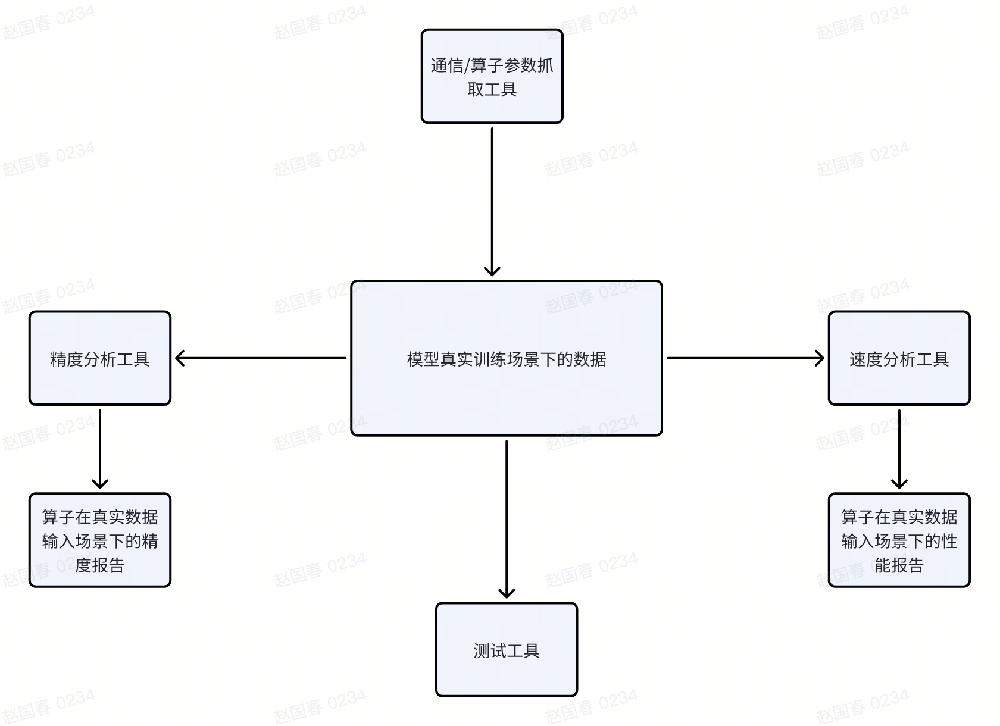

# op_capture

## 算子参数抓取工具主要想实现的功能
1. 抓到算子在模型训练时的真实输入输出
2. 能方便离线复现训练时的真实输入，并方便做精度和性能对比
3. 可只抓取指定算子的参数
4. 可抓取所有算子参数
5. 用户可手动排除指定算子不抓取
6. 可抓取集合通信的输入输出
7. 可抓取反向计算时的梯度
8. 不侵入修改上层训练代码

https://aicarrier.feishu.cn/wiki/YhXwwarb4iTYFUkPQeHct1zHnhe